kmod-Linux内核模块工具简介
======================

1. 项目背景分析
----------------

kmod 是为了能够操作 Linux 内核模块而推出的一系列工具集，这些操作包括 插入（insert），删除（remove），列出（list），检查属性（check properties）和解决依赖关系（dependencies）。

这些工具在底层都需要用到 libkmod 这个库，相关的源码也会跟着 kmod 项目一同发布。这个项目的目标是能够实现与在此之前 module-init-tools 项目所提供的工具兼容。

### 项目建立时间
从 git.kernel.org 上的 commit log 分析，该项目的建立时间是 2011-11-21。最初的项目是通过继承了 libabc 的框架开始逐步演变而来。2011-12-15 发布了 kmod 1 版本。

参考*项目主页*  
<http://git.kernel.org/cgit/utils/kernel/kmod/kmod.git>

### 项目创建者和维护者
创建者是 Lucas De Marchi。这个人就职于巴西 Brazil Campinas 的一家公司ProFUSION Embedded Systems（该公司的主页http://profusion.mobi/），从他在 github 个人项目的帐号创建时间看是 2008年10月30号，应该是属于比较早期的 github 用户。

参考*个人主页*  
<https://github.com/lucasdemarchi>

### 项目更新记录
项目最近一次提交 commit log 表明，该项目近期处于一个比较活跃的状态。从 2013-4-9 发布了最新的 kmod 13 版本之后，该项目几乎每隔1，2天有一次或多次提交。最近的一次提交是 2013-4-17，主要的贡献者仍然是 Lucas De Marchi。

参考*提交记录*  
<http://git.kernel.org/cgit/utils/kernel/kmod/kmod.git/log/>

### 项目版本情况
第一个可以下载的软件包 kmod-1.tar.gz 是2012-2-24 上传的，最新的软件包 kmod-13.tar.gz 是 2013-4-9 上传的。

目前 kmod 已经发布到了第13个版本，从项目 NEWS 中可以看到，项目从版本 1 就开始支持原来的 insmod/rmmod/lsmod/modprobe 这几个常用命令，发展至今libkmod 库已经提供了100多个函数接口用于方便用户管理内核模块。

### 项目资源汇总
* 代码下载  
	<https://www.kernel.org/pub/linux/utils/kernel/kmod>

* 邮件列表  
	<linux-modules@vger.kernel.org>

* Git项目仓库  
	git://git.kernel.org/pub/scm/utils/kernel/kmod/kmod.git  
	<https://git.kernel.org/pub/scm/utils/kernel/kmod/kmod.git>

* Gitweb页面  
	<http://git.kernel.org/?p=utils/kernel/kmod/kmod.git>

2. 项目技术分析
---------------

### 开发环境准备
* 首先需要安装如下的软件工具
	- GCC compiler 编译工具
	- GNU C library 标准C库
	- autoconf 自动化配置工具，可以生成项目所需的 makefile
	- shtool 一个兼容之前类似 mkdir.sh/install.sh 的shell脚本工具
	- libtool 制作可生成依赖关系的共享库，生成文件后缀名为 .la, lo
	- xsltproc 快速XSLT引擎，可以通过XSL层叠样式表把XML转换为其他格式，例如html/pdf

* 可选的依赖关系:
	- ZLIB library
	- LZMA library
	
### 编译和安装
	$ sudo apt-get install autoconf 
	$ sudo apt-get install shtool 
	$ sudo apt-get install libtool
	$ sudo apt-get install xsltproc 

	$ aclocal
	$ autoconf
	$ ./configure CFLAGS="-g -O2" --prefix=/usr --sysconfdir=/etc --libdir=/usr/lib
	$ make && make install

### 错误及解决
代码编译过程会出现不少问题，但都可以通过安装和配置逐一解决。现对编译过程中的问题做一总结：

**1）autoconf 缺少环境变量文件**

 	$ autoconf 
	configure.ac:10: error: possibly undefined macro: AM_INIT_AUTOMAKE
	      If this token and others are legitimate, please use m4_pattern_allow.
	      See the Autoconf documentation.
	configure.ac:28: error: possibly undefined macro: AM_PROG_CC_C_O
	configure.ac:89: error: possibly undefined macro: AM_CONDITIONAL
	$ aclocal

通过 aclocal 命令生成，获取当前系统的环境变量，生成一个 aclocal.m4 文件。

**2）configure 脚本执行时缺少 libtool 工具**

	$ ./configure CFLAGS="-g -O2" --prefix=/usr --sysconfdir=/etc --libdir=/usr/lib
	configure: error: cannot find install-sh, install.sh, or shtool in build-aux "."/build-aux
	$ autoreconf -f -i -Wall,no-obsolete
	Can't exec "libtoolize": No such file or directory at /usr/bin/autoreconf line 196.
	Use of uninitialized value in pattern match (m//) at /usr/bin/autoreconf line 196.
	$ sudo apt-get install libtool

通过 sudo apt-get 安装解决。

**3）configuire 脚本执行缺少 xsltproc 命令**

	$ ./configure CFLAGS="-g -O2" --prefix=/usr --sysconfdir=/etc --libdir=/usr/lib
	configure: error: xsltproc command not found, try ./configure --disable-manpages
	$ sudo apt-get install xsltproc 

通过 sudo apt-get 安装解决，成功之后，会在当前目录下生成 Makefile 文件。

### 编译过程
编译过程总体比较顺利，执行 make 和 make install 命令即可完成。

	$ make
	make --no-print-directory all-recursive
	Making all in .
	  CC     libkmod/libkmod.lo
	  CC     libkmod/libkmod-list.lo
	  CC     libkmod/libkmod-config.lo
	  CC     libkmod/libkmod-index.lo
	  CC     libkmod/libkmod-module.lo
	  CC     libkmod/libkmod-file.lo
	  CC     libkmod/libkmod-elf.lo
	  CC     libkmod/libkmod-signature.lo
	  CC     libkmod/libkmod-hash.lo
	  CC     libkmod/libkmod-array.lo
	  CC     libkmod/libkmod-util.lo
	  CCLD   libkmod/libkmod-util.la
	  CCLD   libkmod/libkmod.la
	  CCLD   libkmod/libkmod-private.la
	  CC     tools/kmod.o
	  CC     tools/lsmod.o
	  CC     tools/rmmod.o
	  CC     tools/insmod.o
	  CC     tools/modinfo.o
	  CC     tools/modprobe.o
	  CC     tools/depmod.o
	  CC     tools/log.o
	  CC     tools/static-nodes.o
	  CCLD   tools/kmod
	  CCLD   tools/kmod-nolib
	  GEN    tools/insmod
	  GEN    tools/rmmod
	  GEN    tools/lsmod
	  GEN    tools/modprobe
	  GEN    tools/modinfo
	  GEN    tools/depmod
	  GEN    libkmod/libkmod.pc
	Making all in libkmod/docs
	make[2]: Nothing to be done for `all'.
	Making all in man
	  GEN    depmod.d.5
	  GEN    modprobe.d.5
	  GEN    modules.dep.5
	  GEN    depmod.8
	  GEN    insmod.8
	  GEN    lsmod.8
	  GEN    rmmod.8
	  GEN    modprobe.8
	  GEN    modinfo.8

由以上编译过程可知，项目主要架构分为2层，上层为 tools 目录下提供的各种工具（兼容之前的命令集，例如 insmod/rmmod），下层为 libkmod 目录下生成的 libkmod.la，为上层工具提供所需要的库函数。

### 生成文件
	$ ls tools/ -l | grep x
	lrwxrwxrwx 1 akaedu akaedu     10 Apr 17 04:43 depmod -> kmod-nolib
	lrwxrwxrwx 1 akaedu akaedu     10 Apr 17 04:43 insmod -> kmod-nolib
	-rwxrwxr-x 1 akaedu akaedu   8385 Apr 17 04:43 kmod
	-rwxrwxr-x 1 akaedu akaedu 488644 Apr 17 04:43 kmod-nolib
	lrwxrwxrwx 1 akaedu akaedu     10 Apr 17 04:43 lsmod -> kmod-nolib
	lrwxrwxrwx 1 akaedu akaedu     10 Apr 17 04:43 modinfo -> kmod-nolib
	lrwxrwxrwx 1 akaedu akaedu     10 Apr 17 04:43 modprobe -> kmod-nolib
	lrwxrwxrwx 1 akaedu akaedu     10 Apr 17 04:43 rmmod -> kmod-nolib

可以看出以上所有工具，均是 kmod-nolib 的软链接。实现了一个 kmod-nolib 程序，也就实现了之前的各种工具。
这种实现思路，类似于嵌入式开发中的 busybox 项目，也是实现了一堆工具，但只有一个真正的可执行文件。

	$ ls libkmod/ -l | grep lo 
	-rw-rw-r-- 1 akaedu akaedu   308 Apr 17 04:43 libkmod-array.lo
	-rw-rw-r-- 1 akaedu akaedu   310 Apr 17 04:43 libkmod-config.lo
	-rw-rw-r-- 1 akaedu akaedu   304 Apr 17 04:43 libkmod-elf.lo
	-rw-rw-r-- 1 akaedu akaedu   306 Apr 17 04:43 libkmod-file.lo
	-rw-rw-r-- 1 akaedu akaedu   306 Apr 17 04:43 libkmod-hash.lo
	-rw-rw-r-- 1 akaedu akaedu   308 Apr 17 04:43 libkmod-index.lo
	-rw-rw-r-- 1 akaedu akaedu   306 Apr 17 04:43 libkmod-list.lo
	-rw-rw-r-- 1 akaedu akaedu   296 Apr 17 04:43 libkmod.lo
	-rw-rw-r-- 1 akaedu akaedu   310 Apr 17 04:43 libkmod-module.lo
	-rw-rw-r-- 1 akaedu akaedu   316 Apr 17 04:43 libkmod-signature.lo
	-rw-rw-r-- 1 akaedu akaedu   306 Apr 17 04:43 libkmod-util.lo

上面所列的 lo 文件中，libkmod-module.lo 中包含了在整个库中，最靠近上层调用所需要用的接口函数。其他的 lo 文件基本上都是为 libkmod-module.lo 所服务的，比较重要的例如 libkmod-elf, libkmod-file, libkmod-list 等。

	$ ls libkmod/ -l | grep la
	-rw-rw-r-- 1 akaedu akaedu   923 Apr 17 04:43 libkmod.la
	-rw-rw-r-- 1 akaedu akaedu   893 Apr 17 04:43 libkmod-private.la
	-rw-rw-r-- 1 akaedu akaedu   884 Apr 17 04:43 libkmod-util.la

最终提供的库文件是以 libkmod.la 的形式存在。	

	$ ls libkmod/ -l | grep pc
	-rw-rw-r-- 1 akaedu akaedu   210 Apr 17 04:43 libkmod.pc
	-rw-rw-r-- 1 akaedu akaedu   255 Apr 17 00:53 libkmod.pc.in

此文件暂时没看出有什么特殊的作用，只包含了一些对当前库的说明信息，是一个纯文本文件。

### 安装过程

	$ make && make install
	make --no-print-directory all-recursive
	Making all in .
	Making all in libkmod/docs
	make[2]: Nothing to be done for `all'.
	Making all in man
	make[2]: Nothing to be done for `all'.
	Making install in .
	test -z "/usr/lib" || /bin/mkdir -p "/usr/lib"
	 /bin/bash ./libtool   --mode=install /usr/bin/install -c   libkmod/libkmod.la '/usr/lib'
	libtool: install: /usr/bin/install -c libkmod/.libs/libkmod.so.2.2.3 /usr/lib/libkmod.so.2.2.3
	/usr/bin/install: cannot create regular file `/usr/lib/libkmod.so.2.2.3': Permission denied
	make[2]: *** [install-libLTLIBRARIES] Error 1
	make[1]: *** [install-am] Error 2
	make: *** [install-recursive] Error 1

编译过程中，因为需要用到对 /usr/bin 目录的读写权限，因此需要用 sudo 来执行。

	$ sudo make install
	Making install in .
	test -z "/usr/lib" || /bin/mkdir -p "/usr/lib"
	 /bin/bash ./libtool   --mode=install /usr/bin/install -c   libkmod/libkmod.la '/usr/lib'
	libtool: install: /usr/bin/install -c libkmod/.libs/libkmod.so.2.2.3 /usr/lib/libkmod.so.2.2.3
	libtool: install: (cd /usr/lib && { ln -s -f libkmod.so.2.2.3 libkmod.so.2 || { rm -f libkmod.so.2 && ln -s libkmod.so.2.2.3 libkmod.so.2; }; })
	libtool: install: (cd /usr/lib && { ln -s -f libkmod.so.2.2.3 libkmod.so || { rm -f libkmod.so && ln -s libkmod.so.2.2.3 libkmod.so; }; })
	libtool: install: /usr/bin/install -c libkmod/.libs/libkmod.lai /usr/lib/libkmod.la
	libtool: finish: PATH="/usr/local/sbin:/usr/local/bin:/usr/sbin:/usr/bin:/sbin:/bin:/sbin" ldconfig -n /usr/lib
	----------------------------------------------------------------------
	Libraries have been installed in:
	   /usr/lib

	If you ever happen to want to link against installed libraries
	in a given directory, LIBDIR, you must either use libtool, and
	specify the full pathname of the library, or use the `-LLIBDIR'
	flag during linking and do at least one of the following:
	   - add LIBDIR to the `LD_LIBRARY_PATH' environment variable
	     during execution
	   - add LIBDIR to the `LD_RUN_PATH' environment variable
	     during linking
	   - use the `-Wl,-rpath -Wl,LIBDIR' linker flag
	   - have your system administrator add LIBDIR to `/etc/ld.so.conf'

	See any operating system documentation about shared libraries for
	more information, such as the ld(1) and ld.so(8) manual pages.
	----------------------------------------------------------------------
	test -z "/usr/bin" || /bin/mkdir -p "/usr/bin"
	  /bin/bash ./libtool   --mode=install /usr/bin/install -c tools/kmod '/usr/bin'
	libtool: install: /usr/bin/install -c tools/.libs/kmod /usr/bin/kmod
	make --no-print-directory install-exec-hook
	if test "/usr/lib" != "/usr/lib"; then \
			/bin/mkdir -p /usr/lib && \
			so_img_name=$(readlink /usr/lib/libkmod.so) && \
			so_img_rel_target_prefix=$(echo /usr/lib | sed 's,\(^/\|\)[^/][^/]*,..,g') && \
			ln -sf $so_img_rel_target_prefix/usr/lib/$so_img_name /usr/lib/libkmod.so && \
			mv /usr/lib/libkmod.so.* /usr/lib; \
		fi
	test -z "/usr/include" || /bin/mkdir -p "/usr/include"
	 /usr/bin/install -c -m 644 libkmod/libkmod.h '/usr/include'
	test -z "/usr/lib/pkgconfig" || /bin/mkdir -p "/usr/lib/pkgconfig"
	 /usr/bin/install -c -m 644 libkmod/libkmod.pc '/usr/lib/pkgconfig'
	Making install in libkmod/docs
	make[2]: Nothing to be done for `install-exec-am'.
	make[2]: Nothing to be done for `install-data-am'.
	Making install in man
	make[2]: Nothing to be done for `install-exec-am'.
	test -z "/usr/share/man/man5" || /bin/mkdir -p "/usr/share/man/man5"
	 /usr/bin/install -c -m 644 depmod.d.5 modprobe.d.5 modules.dep.5 modules.dep.bin.5 '/usr/share/man/man5'
	test -z "/usr/share/man/man8" || /bin/mkdir -p "/usr/share/man/man8"
	 /usr/bin/install -c -m 644 depmod.8 insmod.8 lsmod.8 rmmod.8 modprobe.8 modinfo.8 '/usr/share/man/man8'
	$ sudo make install

这个 make 和 make install 的过程，帮助我们理清了哪些文件参与最后的编译生成过程。特别是对于最后 make install 的执行分析，也让我们了解了项目最终要实现的目标和生成的重要文件。以下将对这一过程展开详细分析。

### 安装文件
	$ ls /usr/lib/libkmod.so
	libkmod.so        libkmod.so.2      libkmod.so.2.2.3  
	$ ls /usr/lib/libkmod.so* -l
	lrwxrwxrwx 1 root root     16 Apr 17 04:55 /usr/lib/libkmod.so -> libkmod.so.2.2.3
	lrwxrwxrwx 1 root root     16 Apr 17 04:55 /usr/lib/libkmod.so.2 -> libkmod.so.2.2.3
	-rwxr-xr-x 1 root root 313349 Apr 17 04:55 /usr/lib/libkmod.so.2.2.3

libkmod.so 是一个软链接，安装在系统的 /usr/lib 目录下，链接的时候只需要指定 -lkmod 就可以。	

	$ ls /usr/lib/libkmod.l* -l
	-rwxr-xr-x 1 root root 924 Apr 17 04:55 /usr/lib/libkmod.la

	$ ls /usr/lib/libkmod.* -l
	-rwxr-xr-x 1 root root    924 Apr 17 04:55 /usr/lib/libkmod.la
	lrwxrwxrwx 1 root root     16 Apr 17 04:55 /usr/lib/libkmod.so -> libkmod.so.2.2.3
	lrwxrwxrwx 1 root root     16 Apr 17 04:55 /usr/lib/libkmod.so.2 -> libkmod.so.2.2.3
	-rwxr-xr-x 1 root root 313349 Apr 17 04:55 /usr/lib/libkmod.so.2.2.3

真正起作用的 so 文件，也就是 libkmod 共享库的 real name 是 libkmod.so.2.2.3。

	$ ls /usr/bin/kmod  -l
	-rwxr-xr-x 1 root root 233584 Apr 17 04:55 /usr/bin/kmod
	$ file /usr/bin/kmod
	/usr/bin/kmod: ELF 32-bit LSB executable, Intel 80386, version 1 (SYSV), dynamically linked (uses shared libs), for GNU/Linux 2.6.24, BuildID[sha1]=0x9d4131d1eb78b1e1852cc5ad44f06417ae3caa3c, not stripped
	$ kmod
	missing command
	kmod - Manage kernel modules: list, load, unload, etc
	Usage:
		kmod [options] command [command_options]

	Options:
		-V, --version     show version
		-h, --help        show this help

	Commands:
	  help         Show help message
	  list         list currently loaded modules
	  static-nodes outputs the static-node information installed with the currently running kernel

	kmod also handles gracefully if called from following symlinks:
	  lsmod        compat lsmod command
	  rmmod        compat rmmod command
	  insmod       compat insmod command
	  modinfo      compat modinfo command
	  modprobe     compat modprobe command
	  depmod       compat depmod command

kmod 是一个工具，可以实现内核模块的 list 和 打印输出已经被加载的内核模块的详细信息。

	$ ls /usr/include/libkmod.h -l
	-rw-r--r-- 1 root root 9429 Apr 17 04:55 /usr/include/libkmod.h
	$ 文件内容见下面小节

头文件是最重要的生成文件，会被之后所有调用 libkmod 库的上层应用所包含。一个文件就包含了所有需要用的函数接口声明，使用起来也非常方便。只不过这个文件中包含了较多的函数，互相之间不是平行的，内部是有上下层次关系的。

	$ ls /usr/lib/pkgconfig/libkmod.pc -l
	-rw-r--r-- 1 root root 210 Apr 17 04:55 /usr/lib/pkgconfig/libkmod.pc
	$ cat /usr/lib/pkgconfig/libkmod.pc 
	prefix=/usr
	exec_prefix=/usr
	libdir=/usr/lib
	includedir=/usr/include

	Name: libkmod
	Description: Library to deal with kernel modules
	Version: 13
	Libs: -L${libdir} -lkmod
	Libs.private:  
	Cflags: -I${includedir}
	$ 

这个文件只是一个纯文本文件，里面包含了如上所列出的信息。

	$ ls /usr/share/man/man5/ -l | grep "Apr 17"
	-rw-r--r-- 1 root root  3969 Apr 17 04:55 depmod.d.5
	-rw-r--r-- 1 root root  9306 Apr 17  2012 fonts-conf.5.gz
	-rw-r--r-- 1 root root  1599 Apr 17  2012 initramfs.conf.5.gz
	-rw-r--r-- 1 root root  8059 Apr 17 04:55 modprobe.d.5
	-rw-r--r-- 1 root root  2494 Apr 17 04:55 modules.dep.5
	-rw-r--r-- 1 root root    18 Apr 17 04:55 modules.dep.bin.5
	-rw-r--r-- 1 root root   585 Apr 17  2012 update-initramfs.conf.5.gz
	$ ls /usr/share/man/man8/ -l | grep "Apr 17"
	-rw-r--r-- 1 root root  6398 Apr 17 04:55 depmod.8
	-rw-r--r-- 1 root root  5170 Apr 17  2012 initramfs-tools.8.gz
	-rw-r--r-- 1 root root  2151 Apr 17 04:55 insmod.8
	-rw-r--r-- 1 root root   526 Apr 17  2012 lsinitramfs.8.gz
	-rw-r--r-- 1 root root  1839 Apr 17 04:55 lsmod.8
	-rw-r--r-- 1 root root  1570 Apr 17  2012 mkinitramfs.8.gz
	-rw-r--r-- 1 root root  4009 Apr 17 04:55 modinfo.8
	-rw-r--r-- 1 root root 10618 Apr 17 04:55 modprobe.8
	-rw-r--r-- 1 root root  3058 Apr 17 04:55 rmmod.8
	-rw-r--r-- 1 root root  1016 Apr 17  2012 update-initramfs.8.gz
	
以上所有文件，均为 man 手册所准备的，通过 make install 将安装到系统路径 /usr/share/man/man8 下。

### 功能简介
* libkmod.so
	- kmod 库的共享库文件，用于动态链接。

* libkmod.la
	- 用 libtool 工具生成的库文件，其实就是一个文本文件，记录同名共享库的相关信息
	- libtool 工具的作用，是在编译大型软件的过程中解决了库的依赖问题。
	- 特别是在交叉编译的条件下，解决动态链接器如何去寻找共享库的问题。

* kmod
	- 一个管理内核模块的工具，提供列表list，加载load，卸载unload等功能。
	- 目前的版本似乎只支持 help, list, static_nodes 三条命令
	- help 列出帮助信息
	- list 列出当前加载模块
	- static-nodes 输出当前内核加载的 static-node 信息，包括设备节点文件名，类型，主设备号和次设备号。

* libkmod.h
	- 使用 libkmod 库所需要包含的头文件，详细接口定义见下节--项目代码分析。

* libkmod.pc
	- 文本文件，包含了使用 libkmod 库所需要了解的一些信息，例如 安装目录，头文件所在目录，库名称，描述等。

* man5 & man8
	- 提供通过类似 man 8 insmod 命令来查看帮助的源文件 inssmod.8 
	- 提供通过类似 man 5 depmod.d 命令来查看帮助的源文件 depmod.d.5 
	
3. 项目代码分析
---------------

### 源码目录结构
* tools
	- insmod.c
	- rmmod.c
	- lsmod.c
	- depmod.c
	- modinfo.c
	- modprobe.c
	- kmod.c
	- kmod.h
	- log.c
	- log.h
	- static-nodes.c
* libkmod
	- COPYING
	- docs
	- libkmod-array.c
	- libkmod-array.h
	- libkmod.c
	- libkmod-config.c
	- libkmod-elf.c
	- libkmod-file.c
	- libkmod.h
	- libkmod-hash.c
	- libkmod-hash.h
	- libkmod-index.c
	- libkmod-index.h
	- libkmod-list.c
	- libkmod-module.c
	- libkmod.pc.in
	- libkmod-private.h
	- libkmod-signature.c
	- libkmod.sym
	- libkmod-util.c
	- libkmod-util.h
	- macro.h
	- missing.h
	- README
* testsuite
	- COPYING
	- delete_module.c
	- init_module.c
	- mkdir.c
	- mkdir.h
	- path.c
	- README
	- rootfs-pristine
	- stripped-module.h
	- test-alias.c
	- test-blacklist.c
	- test-dependencies.c
	- test-depmod.c
	- test-init.c
	- test-loaded.c
	- test-modinfo.c
	- test-modprobe.c
	- test-new-module.c
	- testsuite.c
	- testsuite.h
	- test-testsuite.c
	- uname.c
* m4
	- attributes.m4
* man
	- depmod.d.xml
	- depmod.xml
	- insmod.xml
	- lsmod.xml
	- Makefile.am
	- modinfo.xml
	- modprobe.d.xml
	- modprobe.xml
	- modules.dep.xml
	- rmmod.xml

### 头文件分析

	$ cat /usr/include/libkmod.h 

	/*
	 * libkmod - interface to kernel module operations
	 *
	 * Copyright (C) 2011-2013  ProFUSION embedded systems
	 *
	 * This library is free software; you can redistribute it and/or
	 * modify it under the terms of the GNU Lesser General Public
	 * License as published by the Free Software Foundation; either
	 * version 2.1 of the License, or (at your option) any later version.
	 *
	 * This library is distributed in the hope that it will be useful,
	 * but WITHOUT ANY WARRANTY; without even the implied warranty of
	 * MERCHANTABILITY or FITNESS FOR A PARTICULAR PURPOSE.  See the GNU
	 * Lesser General Public License for more details.
	 *
	 * You should have received a copy of the GNU Lesser General Public
	 * License along with this library; if not, write to the Free Software
	 * Foundation, Inc., 51 Franklin St, Fifth Floor, Boston, MA  02110-1301  USA
	 */

	#pragma once
	#ifndef _LIBKMOD_H_
	#define _LIBKMOD_H_

	#include <fcntl.h>
	#include <stdarg.h>
	#include <stdbool.h>
	#include <inttypes.h>

	#ifdef __cplusplus
	extern "C" {
	#endif

	/*
	 * kmod_ctx
	 *
	 * library user context - reads the config and system
	 * environment, user variables, allows custom logging
	 */
	struct kmod_ctx;
	struct kmod_ctx *kmod_new(const char *dirname, const char * const *config_paths);
	struct kmod_ctx *kmod_ref(struct kmod_ctx *ctx);
	struct kmod_ctx *kmod_unref(struct kmod_ctx *ctx);
	void kmod_set_log_fn(struct kmod_ctx *ctx,
				void (*log_fn)(void *log_data,
						int priority, const char *file, int line,
						const char *fn, const char *format,
						va_list args),
				const void *data);
	int kmod_get_log_priority(const struct kmod_ctx *ctx);
	void kmod_set_log_priority(struct kmod_ctx *ctx, int priority);
	void *kmod_get_userdata(const struct kmod_ctx *ctx);
	void kmod_set_userdata(struct kmod_ctx *ctx, const void *userdata);

	/*
	 * Management of libkmod's resources
	 */
	int kmod_load_resources(struct kmod_ctx *ctx);
	void kmod_unload_resources(struct kmod_ctx *ctx);

	enum kmod_resources {
		KMOD_RESOURCES_OK = 0,
		KMOD_RESOURCES_MUST_RELOAD = 1,
		KMOD_RESOURCES_MUST_RECREATE = 2,
	};
	int kmod_validate_resources(struct kmod_ctx *ctx);

	enum kmod_index {
		KMOD_INDEX_MODULES_DEP = 0,
		KMOD_INDEX_MODULES_ALIAS,
		KMOD_INDEX_MODULES_SYMBOL,
		KMOD_INDEX_MODULES_BUILTIN,
		/* Padding to make sure enum is not mapped to char */
		_KMOD_INDEX_PAD = (1 << 31),
	};
	int kmod_dump_index(struct kmod_ctx *ctx, enum kmod_index type, int fd);

	/*
	 * kmod_list
	 *
	 * access to kmod generated lists
	 */
	struct kmod_list;
	struct kmod_list *kmod_list_next(const struct kmod_list *list,
							const struct kmod_list *curr);
	struct kmod_list *kmod_list_prev(const struct kmod_list *list,
							const struct kmod_list *curr);
	struct kmod_list *kmod_list_last(const struct kmod_list *list);

	#define kmod_list_foreach(list_entry, first_entry) \
		for (list_entry = first_entry; \
			list_entry != NULL; \
			list_entry = kmod_list_next(first_entry, list_entry))

	#define kmod_list_foreach_reverse(list_entry, first_entry) \
		for (list_entry = kmod_list_last(first_entry); \
			list_entry != NULL; \
			list_entry = kmod_list_prev(first_entry, list_entry))

	/*
	 * kmod_config_iter
	 *
	 * access to configuration lists - it allows to get each configuration's
	 * key/value stored by kmod
	 */
	struct kmod_config_iter;
	struct kmod_config_iter *kmod_config_get_blacklists(const struct kmod_ctx *ctx);
	struct kmod_config_iter *kmod_config_get_install_commands(const struct kmod_ctx *ctx);
	struct kmod_config_iter *kmod_config_get_remove_commands(const struct kmod_ctx *ctx);
	struct kmod_config_iter *kmod_config_get_aliases(const struct kmod_ctx *ctx);
	struct kmod_config_iter *kmod_config_get_options(const struct kmod_ctx *ctx);
	struct kmod_config_iter *kmod_config_get_softdeps(const struct kmod_ctx *ctx);
	const char *kmod_config_iter_get_key(const struct kmod_config_iter *iter);
	const char *kmod_config_iter_get_value(const struct kmod_config_iter *iter);
	bool kmod_config_iter_next(struct kmod_config_iter *iter);
	void kmod_config_iter_free_iter(struct kmod_config_iter *iter);

	/*
	 * kmod_module
	 *
	 * Operate on kernel modules
	 */
	struct kmod_module;
	int kmod_module_new_from_name(struct kmod_ctx *ctx, const char *name,
							struct kmod_module **mod);
	int kmod_module_new_from_path(struct kmod_ctx *ctx, const char *path,
							struct kmod_module **mod);
	int kmod_module_new_from_lookup(struct kmod_ctx *ctx, const char *given_alias,
							struct kmod_list **list);
	int kmod_module_new_from_loaded(struct kmod_ctx *ctx,
							struct kmod_list **list);

	struct kmod_module *kmod_module_ref(struct kmod_module *mod);
	struct kmod_module *kmod_module_unref(struct kmod_module *mod);
	int kmod_module_unref_list(struct kmod_list *list);
	struct kmod_module *kmod_module_get_module(const struct kmod_list *entry);

	/* Removal flags */
	enum kmod_remove {
		KMOD_REMOVE_FORCE = O_TRUNC,
		KMOD_REMOVE_NOWAIT = O_NONBLOCK,
	};

	/* Insertion flags */
	enum kmod_insert {
		KMOD_INSERT_FORCE_VERMAGIC = 0x1,
		KMOD_INSERT_FORCE_MODVERSION = 0x2,
	};

	/* Flags to kmod_module_probe_insert_module() */
	enum kmod_probe {
		KMOD_PROBE_FORCE_VERMAGIC =		0x00001,
		KMOD_PROBE_FORCE_MODVERSION =		0x00002,
		KMOD_PROBE_IGNORE_COMMAND =		0x00004,
		KMOD_PROBE_IGNORE_LOADED =		0x00008,
		KMOD_PROBE_DRY_RUN =			0x00010,
		KMOD_PROBE_FAIL_ON_LOADED =		0x00020,

		/* codes below can be used in return value, too */
		KMOD_PROBE_APPLY_BLACKLIST_ALL =	0x10000,
		KMOD_PROBE_APPLY_BLACKLIST =		0x20000,
		KMOD_PROBE_APPLY_BLACKLIST_ALIAS_ONLY =	0x40000,
	};

	/* Flags to kmod_module_apply_filter() */
	enum kmod_filter {
		KMOD_FILTER_BLACKLIST = 0x00001,
		KMOD_FILTER_BUILTIN = 0x00002,
	};

	int kmod_module_remove_module(struct kmod_module *mod, unsigned int flags);
	int kmod_module_insert_module(struct kmod_module *mod, unsigned int flags,
								const char *options);
	int kmod_module_probe_insert_module(struct kmod_module *mod,
				unsigned int flags, const char *extra_options,
				int (*run_install)(struct kmod_module *m,
							const char *cmdline, void *data),
				const void *data,
				void (*print_action)(struct kmod_module *m, bool install,
							const char *options));

	const char *kmod_module_get_name(const struct kmod_module *mod);
	const char *kmod_module_get_path(const struct kmod_module *mod);
	const char *kmod_module_get_options(const struct kmod_module *mod);
	const char *kmod_module_get_install_commands(const struct kmod_module *mod);
	const char *kmod_module_get_remove_commands(const struct kmod_module *mod);
	struct kmod_list *kmod_module_get_dependencies(const struct kmod_module *mod);
	int kmod_module_get_softdeps(const struct kmod_module *mod,
					struct kmod_list **pre, struct kmod_list **post);
	int kmod_module_get_filtered_blacklist(const struct kmod_ctx *ctx,
						const struct kmod_list *input,
						struct kmod_list **output) __attribute__ ((deprecated));
	int kmod_module_apply_filter(const struct kmod_ctx *ctx,
						enum kmod_filter filter_type,
						const struct kmod_list *input,
						struct kmod_list **output);

	/*
	 * Information regarding "live information" from module's state, as returned
	 * by kernel
	 */

	enum kmod_module_initstate {
		KMOD_MODULE_BUILTIN = 0,
		KMOD_MODULE_LIVE,
		KMOD_MODULE_COMING,
		KMOD_MODULE_GOING,
		/* Padding to make sure enum is not mapped to char */
		_KMOD_MODULE_PAD = (1 << 31),
	};
	const char *kmod_module_initstate_str(enum kmod_module_initstate state);
	int kmod_module_get_initstate(const struct kmod_module *mod);
	int kmod_module_get_refcnt(const struct kmod_module *mod);
	struct kmod_list *kmod_module_get_holders(const struct kmod_module *mod);
	struct kmod_list *kmod_module_get_sections(const struct kmod_module *mod);
	const char *kmod_module_section_get_name(const struct kmod_list *entry);
	unsigned long kmod_module_section_get_address(const struct kmod_list *entry);
	void kmod_module_section_free_list(struct kmod_list *list);
	long kmod_module_get_size(const struct kmod_module *mod);

	/*
	 * Information retrieved from ELF headers and sections
	 */

	int kmod_module_get_info(const struct kmod_module *mod, struct kmod_list **list);
	const char *kmod_module_info_get_key(const struct kmod_list *entry);
	const char *kmod_module_info_get_value(const struct kmod_list *entry);
	void kmod_module_info_free_list(struct kmod_list *list);

	int kmod_module_get_versions(const struct kmod_module *mod, struct kmod_list **list);
	const char *kmod_module_version_get_symbol(const struct kmod_list *entry);
	uint64_t kmod_module_version_get_crc(const struct kmod_list *entry);
	void kmod_module_versions_free_list(struct kmod_list *list);

	int kmod_module_get_symbols(const struct kmod_module *mod, struct kmod_list **list);
	const char *kmod_module_symbol_get_symbol(const struct kmod_list *entry);
	uint64_t kmod_module_symbol_get_crc(const struct kmod_list *entry);
	void kmod_module_symbols_free_list(struct kmod_list *list);

	enum kmod_symbol_bind {
		KMOD_SYMBOL_NONE = '\0',
		KMOD_SYMBOL_LOCAL = 'L',
		KMOD_SYMBOL_GLOBAL = 'G',
		KMOD_SYMBOL_WEAK = 'W',
		KMOD_SYMBOL_UNDEF = 'U'
	};

	int kmod_module_get_dependency_symbols(const struct kmod_module *mod, struct kmod_list **list);
	const char *kmod_module_dependency_symbol_get_symbol(const struct kmod_list *entry);
	int kmod_module_dependency_symbol_get_bind(const struct kmod_list *entry);
	uint64_t kmod_module_dependency_symbol_get_crc(const struct kmod_list *entry);
	void kmod_module_dependency_symbols_free_list(struct kmod_list *list);

	#ifdef __cplusplus
	} /* extern "C" */
	#endif
	#endif
	$ 

* 头文件是 libkmod 项目所提供的用于包含的函数调用接口，上层编程者一般都需要 include 这个文件。
* 以 insmod 命令实现为例，以下函数接口将会用于这个命令实现过程中，典型的调用用法如下：
	- kmod_new()
	- kmod_module_new_from_path()
	- kmod_module_insert_module()
	- kmod_module_unref()

### 数据结构设计
* struct kmod_ctx
	- 该结构体出现在 libkmod/libkmod.c 文件中
	- 用于读取配置和系统环境参数，用户参数等

结构体定义

	/**
	 * kmod_ctx:
	 *
	 * Opaque object representing the library context.
	 */
	struct kmod_ctx {
		int refcount;
		int log_priority;
		void (*log_fn)(void *data,
		                int priority, const char *file, int line,
		                const char *fn, const char *format, va_list args);
		void *log_data;
		const void *userdata;
		char *dirname;
		struct kmod_config *config;
		struct hash *modules_by_name;
		struct index_mm *indexes[_KMOD_INDEX_MODULES_SIZE];
		unsigned long long indexes_stamp[_KMOD_INDEX_MODULES_SIZE];
	};

* struct kmod_list
	- 该结构体出现在 libkmod/libkmod-private.h 文件中
	- 用于访问 kmod 产生的模块节点链表

结构体定义

	struct list_node {
		struct list_node *next, *prev;
	};

	struct kmod_list {
		struct list_node node;
		void *data;
	};

* struct kmod_config_iter
	- 该结构体出现在 libkmod/libkmod-config.c 文件中

结构体定义

	struct kmod_config_iter {
		enum config_type type;
		bool intermediate;
		const struct kmod_list *list;
		const struct kmod_list *curr;
		void *data;
		const char *(*get_key)(const struct kmod_list *l); 
		const char *(*get_value)(const struct kmod_list *l); 
	};

* struct kmod_module
	- 该结构体出现在 libkmod/libkmod-module.c 文件中

结构体定义

	/**
	 * SECTION:libkmod-module
	 * @short_description: operate on kernel modules
	 */

	/**
	 * kmod_module:
	 *
	 * Opaque object representing a module.
	 */
	struct kmod_module {
		struct kmod_ctx *ctx;
		char *hashkey;
		char *name;
		char *path;
		struct kmod_list *dep;
		char *options;
		const char *install_commands;	/* owned by kmod_config */
		const char *remove_commands;	/* owned by kmod_config */
		char *alias; /* only set if this module was created from an alias */
		struct kmod_file *file;
		int n_dep;
		int refcount;
		struct {
			bool dep : 1;
			bool options : 1;
			bool install_commands : 1;
			bool remove_commands : 1;
		} init;

		/*
		 * private field used by kmod_module_get_probe_list() to detect
		 * dependency loops
		 */
		bool visited : 1;

		/*
		 * set by kmod_module_get_probe_list: indicates for probe_insert()
		 * whether the module's command and softdep should be ignored
		 */
		bool ignorecmd : 1;

		/*
		 * if module was created by searching the modules.builtin file, this
		 * is set. There's nothing much useful one can do with such a
		 * "module", except knowing it's builtin.
		 */
		bool builtin : 1;
	};

### 重要接口实现
* kmod_module_insert_module() in libkmod/libkmod-module.c
	- kmod_module_get_path()
	- file = kmod_file_open()
	- kmod_file_get_direct()
	- size = kmod_file_get_size(file)
	- mem = kmod_file_get_contents(file)
	- kmod_elf_new()
	- kmod_elf_strip_section()
	- kmod_elf_get_memory()
	- init_module(mem, size, args) 
	- kmod_elf_unref()
	- kmod_file_unref()

* 对比 module-init-tools 的实现，可以发现代码的层次逻辑复杂不少
	- realloc()
	- grab_file()
		- open()
		- malloc()
		- read()
		- close()
	- init_module(file, len, options)
	- free()

* kmod_module_remove_module in libkmod/libkmod-module.c
	- delete_module()

kmod-11 详细分析报告
==================

1. 架构分析
----------------

kmod-11 项目的整个技术架构分为3层。最上层是tools目录下的6个命令，中间是libkmod库所提供的各种编程接口，最下层是testsuite所包含的系统调用抽象层，便于在用户空间进行接口测试。

kmod-11 项目系统层次结构如图

下面按照这样的三层架构，按照应用层，库接口层，系统调用模拟层的顺序，依次分析。

### 应用层
应用层实现了6个常用的用户命令，分别是 insmod, rmmod, lsmod, modinfo, depmod, modprobe. 

#### insmod 命令
该命令的功能是: 向Linux内核中插入一个模块

	$ ./kmod-11/tools/insmod -h

	Usage:
		insmod [options] filename [args]
	Options:
		-V, --version     show version
		-h, --help        show this help

#### rmmod 命令
该命令的功能是: 删除内核中的模块

	$ ./kmod-11/tools/rmmod -h
	Usage:
		rmmod [options] modulename ...
	Options:
		-f, --force       forces a module unload and may crash your
			          machine. This requires Forced Module Removal
			          option in your kernel. DANGEROUS
		-s, --syslog      print to syslog, not stderr
		-v, --verbose     enables more messages
		-V, --version     show version
		-h, --help        show this help

#### lsmod 命令
该命令的功能是: 列出内核已载入模块的状态

	$ ./kmod-11/tools/lsmod -h
	Usage: ./kmod-11/tools/lsmod

#### modinfo 命令
该命令的功能是: 显示内核模块的信息

	$ ./kmod-11/tools/modinfo -h
	Usage:
		modinfo [options] filename [args]
	Options:
		-a, --author                Print only 'author'
		-d, --description           Print only 'description'
		-l, --license               Print only 'license'
		-p, --parameters            Print only 'parm'
		-n, --filename              Print only 'filename'
		-0, --null                  Use \0 instead of \n
		-F, --field=FIELD           Print only provided FIELD
		-k, --set-version=VERSION   Use VERSION instead of `uname -r`
		-b, --basedir=DIR           Use DIR as filesystem root for /lib/modules
		-V, --version               Show version
		-h, --help                  Show this help
	$ 

#### depmod 命令
该命令的功能是: 分析可加载模块的依赖性，生成 /lib/modules/3.2.0-29-generic-pae/modules.dep 文件和映射文件。

	$ ./kmod-11/tools/depmod -h
	Usage:
		depmod -[aA] [options] [forced_version]

	If no arguments (except options) are given, "depmod -a" is assumed

	depmod will output a dependency list suitable for the modprobe utility.

	Options:
		-a, --all            Probe all modules
		-A, --quick          Only does the work if there's a new module
		-e, --errsyms        Report not supplied symbols
		-n, --show           Write the dependency file on stdout only
		-P, --symbol-prefix  Architecture symbol prefix
		-C, --config=PATH    Read configuration from PATH
		-v, --verbose        Enable verbose mode
		-w, --warn           Warn on duplicates
		-V, --version        show version
		-h, --help           show this help

	The following options are useful for people managing distributions:
		-b, --basedir=DIR    Use an image of a module tree.
		-F, --filesyms=FILE  Use the file instead of the
			             current kernel symbols.
		-E, --symvers=FILE   Use Module.symvers file to check
			             symbol versions.
	$ 

#### modprobe 命令
该命令的功能是: Linux内核添加或者删除模块

	$ ./kmod-11/tools/modprobe -h
	Usage:
		modprobe [options] [-i] [-b] modulename
		modprobe [options] -a [-i] [-b] modulename [modulename...]
		modprobe [options] -r [-i] modulename
		modprobe [options] -r -a [-i] modulename [modulename...]
		modprobe [options] -c
		modprobe [options] --dump-modversions filename
	Management Options:
		-a, --all                   Consider every non-argument to
			                    be a module name to be inserted
			                    or removed (-r)
		-r, --remove                Remove modules instead of inserting
		    --remove-dependencies   Also remove modules depending on it
		-R, --resolve-alias         Only lookup and print alias and exit
		    --first-time            Fail if module already inserted or removed
		-i, --ignore-install        Ignore install commands
		-i, --ignore-remove         Ignore remove commands
		-b, --use-blacklist         Apply blacklist to resolved alias.
		-f, --force                 Force module insertion or removal.
			                    implies --force-modversions and
			                    --force-vermagic
		    --force-modversion      Ignore module's version
		    --force-vermagic        Ignore module's version magic

	Query Options:
		-D, --show-depends          Only print module dependencies and exit
		-c, --showconfig            Print out known configuration and exit
		-c, --show-config           Same as --showconfig
		    --show-modversions      Dump module symbol version and exit
		    --dump-modversions      Same as --show-modversions

	General Options:
		-n, --dry-run               Do not execute operations, just print out
		-n, --show                  Same as --dry-run
		-C, --config=FILE           Use FILE instead of default search paths
		-d, --dirname=DIR           Use DIR as filesystem root for /lib/modules
		-S, --set-version=VERSION   Use VERSION instead of `uname -r`
		-s, --syslog                print to syslog, not stderr
		-q, --quiet                 disable messages
		-v, --verbose               enables more messages
		-V, --version               show version
		-h, --help                  show this help
	$ 

### 库接口层
库接口层包含了 libkmod 目录下的形如 libkmod-xxx.c 的模块文件，其中涉及用到的编程接口将近100个，形如 kmod_xxx_xxx_xxx 的接口函数。

按照这些接口函数的归属模块划分，我们经过代码分析，可以将它们分为6个重要的核心子模块，分别是 kmod_ctx, kmod_module, kmod_config, kmod_list, kmod_elf, kmod_file。

另外还有6个属于基础类的子模块，为以上6个核心子模块提供支持，分别是 
hash, index_mm，elf，list，array，log。

以下在模块分析小节将分别对这12个模块进行详细说明。

### 系统调用模拟层
系统调用模拟层的实现代码主要集中在 testsuite 目录下，其中最重要的2个实现包含 init_module 系统调用和 delete_module 系统调用的模拟实现。
在这个目录下，也包含了一系列名为 test-xxx.c 的代码，这些代码其实是属于上层用于测试系统调用模拟层实现的功能，本质上还是为了验证 libkmod 库的接口是否正确。
系统调用模拟层的实现，主要是采用了通过文件来模拟内核空间行为的方法。

例如 init_module 调用 create_sysfs_files 创建了 /sys/module/ 目录下的 initstate 文件，文件内容仅仅就是一个 live 字符串表示该模块已经插入到内核中了。有关这个文件，可以参考如下路径 kmod-11/testsuite/rootfs/test-init/sys/module/ext4/initstate （需要 make rootfs）

### 各层之间相互关系图

以上的命令，库，核心子模块，基础子模块以及系统调用模拟层，之间的关系并不是明显分开的，而是互相之间有交错的关系。为了更清楚的说明整个系统各个层次之间的调用关系，我们以下图为例，做简要说明。

其中命令层就是应用层，一般命令的实现都会首先使用 kmod_ctx 和 kmod_module 两个核心子模块的接口，其中 kmod_ctx 调用了 kmod_config 核心子模块和 hash, log, index_mm 基础子模块的接口功能，kmod_module 调用了 kmod_file, kmod_elf, kmod_list 这3个核心子模块的接口功能，以及简介调用了 elf, list 这2个基础子模块的接口功能，同时还使用了模拟层中有关系统调用模拟实现的接口。

因此在我们所列出的6个核心子模块中，kmod_ctx 和 kmod_module 这2个核心子模块占据着更为重要的作用，是整个 libkmod 库的核心中的核心。在下面的分析中，我们还会详细论述它们的功能。

2. 模块分析
----------------

整个 kmod 项目的核心设计思想，是采用面向对象的编程模型，以C语言的结构体为数据结构的核心，将结构体作为对象来看待，围绕结构体来组织相应的函数接口。
这些函数接口，大多具有较强的可读性，从它们的命名中，就能看出是属于哪个对象的什么方法。因为 C 语言中没有对象的概念，我们取而代之以模块来进行论述和分析。

### kmod_ctx 库上下文
该模块的主要功能，是为 kmod module 提供一个执行环境，也就是通常所说的上下文 context 的概念。数据结构的设计，用了 ctx 来表示这个上下文的英文缩写。

该模块主要的实现代码都在 libkmod/libkmod.c，比较常用的数据结构和接口有

	struct kmod_ctx;

	struct kmod_ctx {
		int refcount;
		int log_priority;
		void (*log_fn)(void *data,
		                int priority, const char *file, int line,
		                const char *fn, const char *format, va_list args);
		void *log_data;
		const void *userdata;
		char *dirname;
		struct kmod_config *config;
		struct hash *modules_by_name;
		struct index_mm *indexes[_KMOD_INDEX_MODULES_SIZE];
		unsigned long long indexes_stamp[_KMOD_INDEX_MODULES_SIZE];
	};

以下函数接口在 tools 下的6个命令中都有用到，是必须的基础类的调用。

	struct kmod_ctx *kmod_new(const char *dirname, const char * const *config_paths);
	struct kmod_ctx *kmod_ref(struct kmod_ctx *ctx);
	struct kmod_ctx *kmod_unref(struct kmod_ctx *ctx);
	void kmod_set_log_fn(struct kmod_ctx *ctx,
		                void (*log_fn)(void *log_data,
		                                int priority, const char *file, int line,
		                                const char *fn, const char *format,
		                                va_list args),
		                const void *data);

以下函数接口在 modprobe 命令中有用到。

	int kmod_load_resources(struct kmod_ctx *ctx);
	void kmod_unload_resources(struct kmod_ctx *ctx);

可以看出这些接口的传入参数和传出的返回值，都是与 struct kmod_ctx 相关的。而在这个数据结构中，有几个重要的成员变量，例如 refcount, dirname, hash表引用等，这些都是和具体什么模块无关的抽象数据，代表着任何一个模块在运行时，都必须具备的属性。因此在后面的 struct kmod_module 核心数据结构中，将 struct kmod_ctx *ctx 作为首要包含的第一个成员变量，这也是和 ctx 的重要性分不开的。

### kmod_module 内核模块核心操作
kmod_module 是所有模块中最重要和最核心的模块。该模块的主要功能是抽象了一个对所有内核模块进行操作的对象，它是真正可以代表一个具体的已经被加载到内核，或者即将被加载到内核的模块对象。其中，除了包含刚才所说的 kmod_ctx 上下文的模块，作为该模块运行时环境的一个引用之外，还包含有其他两个重要的数据结构 struct kmod_list *dep 和 struct kmod_file *file，其中 dep 代表着已经被加载到内核中的这个模块所需要的依赖关系，也就是为了要加载这个模块，需要用到的需要提前加载的其他模块列表，这样的模块可能有很多，所以采用了一个链表的方式来记录。file 代表着当前这个被加载模块，在磁盘上所对应的文件。这个结构体在下面还会详细解释，其中最重要的信息包括文件的大小，文件的内容在内存中的指针，以及该文件对应的 ELF 格式的文件内容。

该模块主要的实现代码都在 libkmod/libkmod-module.c，比较常用的数据结构和接口有

	struct kmod_module;

	struct kmod_module {
			struct kmod_ctx *ctx;
			char *hashkey;
			char *name;
			char *path;
			struct kmod_list *dep;
			char *options;
			const char *install_commands;	/* owned by kmod_config */
			const char *remove_commands;	/* owned by kmod_config */
			char *alias; /* only set if this module was created from an alias */
			struct kmod_file *file;
			int n_dep;
			int refcount;
			struct {
				bool dep : 1;
				bool options : 1;
				bool install_commands : 1;
				bool remove_commands : 1;
			} init;

			bool visited : 1;
			bool ignorecmd : 1;
			bool builtin : 1;
		};

以下函数接口在 tools 下的6个命令中都有用到，是必须的基础类的调用。其中 初始化的方法有4个，前两个 new_from_name 和 new_from_path 是以所提供的模块文件名来创建单个模块。path 代表着从根目录开始的绝对路径方式，name 代表着从当前目录的相对路径方式。另外两个 new_from_lookup 和 new_from_loaded，分别是以所提供的别名来创建链表，或者直接从已经加载的依赖关系数组中动态创建链表。

	int kmod_module_new_from_name(struct kmod_ctx *ctx, const char *name,
		                                        struct kmod_module **mod);
	int kmod_module_new_from_path(struct kmod_ctx *ctx, const char *path,
		                                        struct kmod_module **mod);
	int kmod_module_new_from_lookup(struct kmod_ctx *ctx, const char *given_alias,
		                                        struct kmod_list **list);
	int kmod_module_new_from_loaded(struct kmod_ctx *ctx,
		                                        struct kmod_list **list);

	struct kmod_module *kmod_module_ref(struct kmod_module *mod);
	struct kmod_module *kmod_module_unref(struct kmod_module *mod);
	int kmod_module_unref_list(struct kmod_list *list);
	struct kmod_module *kmod_module_get_module(const struct kmod_list *entry);

以下函数接口主要用 insmod/rmmod 命令的实现。这2个接口是实现 insmod 和 rmmod 这两个命令时所用到的最主要的 libkmod 库接口。

	int kmod_module_remove_module(struct kmod_module *mod, unsigned int flags);
	int kmod_module_insert_module(struct kmod_module *mod, unsigned int flags,
	
以下函数接口 kmod_module_probe_insert_module 主要用于 modprobe 命令的实现。这个接口和上面的 kmod_module_insert_module 所不同的是，它可以支持分析依赖关系，把当前要加载模块的依赖模块，也同时加载进来，省得用户自己去一个一个加载。

	int kmod_module_probe_insert_module(struct kmod_module *mod,
		                unsigned int flags, const char *extra_options,
		                int (*run_install)(struct kmod_module *m,
		                                        const char *cmdline, void *data),
		                const void *data,
		                void (*print_action)(struct kmod_module *m, bool install,
		                                        const char *options));

以下函数接口主要用 lsmod 命令的实现。

	const char *kmod_module_get_name(const struct kmod_module *mod);
	const char *kmod_module_get_path(const struct kmod_module *mod);
	const char *kmod_module_get_options(const struct kmod_module *mod);
	const char *kmod_module_get_install_commands(const struct kmod_module *mod);
	const char *kmod_module_get_remove_commands(const struct kmod_module *mod);
	struct kmod_list *kmod_module_get_dependencies(const struct kmod_module *mod);
	int kmod_module_get_softdeps(const struct kmod_module *mod,
		                        struct kmod_list **pre, struct kmod_list **post);
	
以下函数接口主要用 modinfo 命令的实现。其中 kmod_module_info_get_key 和 kmod_module_info_get_value 是最重要的两个接口，modinfo 命令所显示的信息冒号左侧的是 key，冒号右侧的是 value，因此，可以说这2个接口是专为 modinfo 命令而准备的。

	int kmod_module_get_info(const struct kmod_module *mod, struct kmod_list **list);
	const char *kmod_module_info_get_key(const struct kmod_list *entry);
	const char *kmod_module_info_get_value(const struct kmod_list *entry);
	void kmod_module_info_free_list(struct kmod_list *list);

### kmod_file 内核模块文件操作
该模块是隶属于 kmod_module 模块的一个成员变量，用来支持 kmod_module 模块的实现。每一个需要加载的模块，都对应于磁盘上的一个文件，要插入一个模块，首先需要从磁盘上把这个文件读出来读到内存中，并且获得文件的大小和指向文件内容的内存指针，用这些数据再构建出一个 ELF 文件的 section 信息，并获得其中有关用模块的 modinfo 内容。

该模块主要的实现代码都在 libkmod/libkmod-file.c，比较常用的数据结构和接口有

	struct kmod_file;

	struct kmod_file {
	#ifdef ENABLE_XZ
		bool xz_used;
	#endif
	#ifdef ENABLE_ZLIB
		gzFile gzf;
	#endif
		int fd; 
		off_t size;
		void *memory;
		const struct file_ops *ops;
		const struct kmod_ctx *ctx;
		struct kmod_elf *elf;
	};

以下函数接口是这个模块中最重要的接口。

	struct kmod_file *kmod_file_open(const struct kmod_ctx *ctx, const char *filename)	
	off_t kmod_file_get_size(const struct kmod_file *file)
	void *kmod_file_get_contents(const struct kmod_file *file)
	void kmod_file_unref(struct kmod_file *file)

### kmod_elf 内核模块elf文件操作
该模块是隶属于 kmod_file 模块的一个成员变量，用来支持 kmod_file 模块的实现。从层次结构上来说，它是高于 kmod_file 的，因为这个模块的创建，需要依赖于 kmod_file 模块提供的 get_contents 和 get_size 接口所获得的返回值。但是从数据结构的隶属关系上，它是属于 kmod_file 内部的一个成员。

该模块主要的实现代码都在 libkmod/libkmod-elf.c ，这个模块所围绕的数据结构是 kmod_elf，其中所包含的最重要的成员是 memory 和 size, 在 kmod_module_insert_module 函数接口中，需要用到这2个数据来创建一个 kmod_elf 变量，因此 kmod_elf_new 函数的2个参数也就是用的这2个变量。

	struct kmod_elf;

	struct kmod_elf {
		const uint8_t *memory;
		uint8_t *changed;
		uint64_t size;
		enum kmod_elf_class class;
		struct kmod_elf_header {
		        struct {
		                uint64_t offset;
		                uint16_t count;
		                uint16_t entry_size;
		        } section;
		        struct {
		                uint16_t section; /* index of the strings section */
		                uint64_t size;
		                uint64_t offset;
		                uint32_t nameoff; /* offset in strings itself */
		        } strings;   
		        uint16_t machine;
		} header;    
	};

以下函数接口是这个模块中最重要的接口。kmod_elf_get_memory 函数是一个典型的面向对象的封装，它实际上就是简单的返回成员变量 memory 的值，但设计者并没有采用直接用指针 elf->memory 的方式来获取成员变量，而是通过接口来访问数据。这个 memory 指针是整个 kmod_elf 数据结构中，最重要的一个成员，它代表着 elf 文件从磁盘被加载到内存之后的内存指针，这个信息在 init_module 系统调用的时候，将被传给内核，由内核完成真正把模块插入到内核空间的工作。

	struct kmod_elf *kmod_elf_new (const void *memory, off_t size)
	int kmod_elf_strip_section(struct kmod_elf *elf, const char *section)
	const void *kmod_elf_get_memory(const struct kmod_elf *elf)
	void kmod_elf_unref(struct kmod_elf *elf)

### kmod_list 内核模块列表
该模块是隶属于 kmod_module 模块的一个成员变量，用来支持 kmod_module 模块的实现。每一个被加载的模块，有的是不依赖于任何其他模块就可以被加载，但也有很多是需要依赖于其他模块被加载后，才能被加载。kmod_list 为这些模块提供了一个索引，通过这个 list 可以获得所有和当前被加载模块有依赖关系的模块列表，然后在这个列表中，这些需要提前被加载的模块也按照依赖关系排好顺序，加载的时候只需要遍历链表，依次加载每个模块，最后再加载当前模块就可以了。这个功能的实现可以参考 modprobe 命令实现流程分析。这个模块在 kmod_module，kmod_config 中都有用到。

该模块主要的实现代码都在 libkmod/libkmod-list.c，其中结构体的定义在 kmod-11/libkmod/libkmod-private.h 中。
	
	struct kmod_list {
		struct list_node node;
		void *data;
	};

	struct kmod_list *kmod_list_append(struct kmod_list *list, const void *data) _must_check_ __attribute__((nonnull(2)));
	struct kmod_list *kmod_list_prepend(struct kmod_list *list, const void *data) _must_check_ __attribute__((nonnull(2)));
	struct kmod_list *kmod_list_remove(struct kmod_list *list) _must_check_;
	struct kmod_list *kmod_list_remove_data(struct kmod_list *list,
		                                const void *data) _must_check_ __attribute__((nonnull(2)));
	struct kmod_list *kmod_list_remove_n_latest(struct kmod_list *list,
		                                        unsigned int n) _must_check_;
	struct kmod_list *kmod_list_insert_after(struct kmod_list *list, const void *data) __attribute__((nonnull(2)));
	struct kmod_list *kmod_list_insert_before(struct kmod_list *list, const void *data) __attribute__((nonnull(2)));
	struct kmod_list *kmod_list_append_list(struct kmod_list *list1, struct kmod_list *list2) _must_check_;

	#define kmod_list_foreach(list_entry, first_entry) \
		for (list_entry = ((first_entry) == NULL) ? NULL : (first_entry); \
		        list_entry != NULL; \
		        list_entry = (list_entry->node.next == &((first_entry)->node)) ? NULL : \
		        container_of(list_entry->node.next, struct kmod_list, node))

### kmod_config 内核模块配置
该模块是隶属于 kmod_ctx 模块的一个成员变量，用来支持 kmod_ctx 模块的实现。在 kmod_new 函数的实现中，需要传递一个 config_paths 字符串变量，这个变量将作为 kmod_config_new 的参数，创建出一个 kmod_config 变量，用来填充 kmod_ctx 数据结构中的 *config，表示配置文件所在的路径。如果默认是NULL，则会到以下3个路径中去寻找 /run/modprobe.d/， /lib/modprobe.d/， /etc/modprobe.d/ ， 否则，则会将 config_paths 作为一个指针数组的基地址，用 config_paths[i] 来遍历整个指针数组，获得每一个路径 char * path = config_paths[i]，然后用 path 来创建 conf_files_list 。

该模块主要的实现代码在 libkmod/libkmod-config.c, 其中结构体的定义在 kmod-11/libkmod/libkmod-private.h 中。

	struct kmod_config;

	struct kmod_config {
		struct kmod_ctx *ctx;
		struct kmod_list *aliases;
		struct kmod_list *blacklists;
		struct kmod_list *options;
		struct kmod_list *remove_commands;
		struct kmod_list *install_commands;
		struct kmod_list *softdeps;

		struct kmod_list *paths;
	};

	int kmod_config_new(struct kmod_ctx *ctx, struct kmod_config **p_config, const char * const *config_paths)
	void kmod_config_free(struct kmod_config *config)

### hash 哈希表模块
该模块是隶属于 kmod_ctx 模块的一个成员变量，用来支持 kmod_ctx 模块的实现。

该模块主要的实现代码都在 libkmod/libkmod-hash.c。

	struct hash;

	struct hash {
		unsigned int count;
		unsigned int step;
		unsigned int n_buckets;
		void (*free_value)(void *value);
		struct hash_bucket buckets[];
	};

	struct hash *hash_new(unsigned int n_buckets, void (*free_value)(void *value));
	void hash_free(struct hash *hash);
	int hash_add(struct hash *hash, const char *key, const void *value);
	int hash_add_unique(struct hash *hash, const char *key, const void *value);
	int hash_del(struct hash *hash, const char *key);
	void *hash_find(const struct hash *hash, const char *key);
	unsigned int hash_get_count(const struct hash *hash);
	void hash_iter_init(const struct hash *hash, struct hash_iter *iter);
	bool hash_iter_next(struct hash_iter *iter, const char **key,
		                                                const void **value);

### index_mm 索引查找模块
该模块是隶属于 kmod_ctx 模块的一个成员变量，用来支持 kmod_ctx 模块的实现。

该模块主要的实现代码都在 libkmod/libkmod-index.c
	
	struct index_mm;

	struct index_mm {
		struct kmod_ctx *ctx;
		void *mm;
		uint32_t root_offset;
		size_t size;
	};

	struct index_file *index_file_open(const char *filename);
	void index_file_close(struct index_file *idx);
	char *index_search(struct index_file *idx, const char *key);
	void index_dump(struct index_file *in, int fd, const char *prefix);
	struct index_value *index_searchwild(struct index_file *idx, const char *key);

	void index_values_free(struct index_value *values);

	/* Implementation using mmap */
	struct index_mm *index_mm_open(struct kmod_ctx *ctx, const char *filename,
		                                        unsigned long long *stamp);
	void index_mm_close(struct index_mm *index);        
	char *index_mm_search(struct index_mm *idx, const char *key);
	struct index_value *index_mm_searchwild(struct index_mm *idx, const char *key);
	void index_mm_dump(struct index_mm *idx, int fd, const char *prefix);

### elf 文件分析模块
该模块是一个在 kmod_elf 内部实现的一系列接口的统称，本身并没有一个同名的数据结构，其中比较具有相关性的一个数据结构就是 kmod_elf_header。这个数据结构隶属于 kmod_elf，用来支持 kmod_elf 模块的实现。

	struct kmod_elf_header {
	        struct {
	                uint64_t offset;
	                uint16_t count;
	                uint16_t entry_size;
	        } section;
	        struct {
	                uint16_t section; /* index of the strings section */
	                uint64_t size;
	                uint64_t offset;
	                uint32_t nameoff; /* offset in strings itself */
	        } strings;
	        uint16_t machine;
	} header;

	enum kmod_elf_class {
		KMOD_ELF_32 = (1 << 1),
		KMOD_ELF_64 = (1 << 2),
		KMOD_ELF_LSB = (1 << 3),
		KMOD_ELF_MSB = (1 << 4)
	};

elf 模块的接口主要包含 elf_get_mem, elf_get_section_header, elf_get_strings_section 这几个常用的，用来分析 elf 文件的内部结构。

	static int elf_identify (const void *memory, uint64_t size)
	static uint64_t elf_get_uint (const struct kmod_elf *elf, uint64_t offset, uint16_t size)
	static int elf_set_uint (struct kmod_elf *elf, uint64_t offset, uint64_t size, uint64_t value)
	static const void *elf_get_mem (const struct kmod_elf *elf, uint64_t offset)
	static const void *elf_get_section_header (const struct kmod_elf *elf, uint16_t idx)
	static int elf_get_section_info (const struct kmod_elf *elf, uint16_t idx, uint64_t *offset, uint64_t *size, uint32_t *nameoff)
	static const char * elf_get_strings_section (const struct kmod_elf *elf, uint64_t *size)

### list 链表模块
该模块是一个基础类的功能模块，它是一个抽象的数据结构 list 的实现。可以用来支持 kmod_list，等于是用 kmod_list 对 list 做了一层封装，也相当于是一个抽象层的概念，然后在这个项目中，更多的使用 kmod_list 来支持其他的数据结构。例如 kmod_config，kmod_module 中都是直接使用了 kmod_list 数据结构，而不是 list。

其中结构体 struct link_node 的定义在 kmod-11/libkmod/libkmod-private.h 中。

	struct list_node {
		struct list_node *next, *prev;
	};

	static struct list_node * list_node_init (struct list_node *node)
	static struct list_node * list_node_next (const struct list_node *node)
	static struct list_node * list_node_prev (const struct list_node *node)
	static void list_node_append (struct list_node *list, struct list_node *node)
	static struct list_node * list_node_remove (struct list_node *node)
	static void list_node_insert_after (struct list_node *list, struct list_node *node)
	static void list_node_insert_before (struct list_node *list, struct list_node *node)
	static void list_node_append_list (struct list_node *list1, struct list_node *list2)

### array 动态数组模块
该模块的主要功能是实现一个动态数组，完成动态数组所需要的初始化init, 插入append，删除remove_at，排序sort 等几个重要的操作。在 depmod 命令的实现中，array 至关重要，正是通过构建了这个动态数组，完成了对这个数组的 sort 排序操作，才得以最终输出 modules.dep 文件，为 modprobe 命令做好了准备。

通过 grep 命令 grep -rns "array_init" kmod-11/* 可以看出，在整个 kmod 项目中，只有 depmod 命令用到了 array 的支持，其他地方都没有用到。但这个模块是一个通用模块，值得我们学习和研究。

该模块主要的实现代码都在 libkmod/libkmod-array.c, 其中结构体 struct array 的定义在 kmod-11/libkmod/libkmod-array.h 中。

	struct array {
		void **array;
		size_t count;
		size_t total;
		size_t step;
	};

	void array_init(struct array *array, size_t step);
	int array_append(struct array *array, const void *element);
	int array_append_unique(struct array *array, const void *element);
	void array_pop(struct array *array);
	void array_free_array(struct array *array);
	void array_sort(struct array *array, int (*cmp)(const void *a, const void *b));
	int array_remove_at(struct array *array, unsigned int pos); 

### log 日志记录模块
该模块的主要功能是实现一个日志记录打印输出功能，这个模块中最核心的函数就是 kmod_log ，该函数的实现代码都在 libkmod/libkmod-list.c 。

	void kmod_log(const struct kmod_ctx *ctx,
		      int priority, const char *file, int line, const char *fn,
		      const char *format, ...)

但是，这个函数并不是直接被调用，而是通过一个宏定义 kmod_log_cond 间接调用，这个宏定义引入了打印优先级 prio 的概念，使得所有日志打印输出都是根据优先级的有条件输出。另外还有一个 kmod_log_null 是一个空打印函数。有关这个部分的实现可以参考 kmod-11/libkmod/libkmod-private.h 文件。

	 14 #define kmod_log_cond(ctx, prio, arg...) \
	 15         do { \
	 16                 if (kmod_get_log_priority(ctx) >= prio) \
	 17                 kmod_log(ctx, prio, __FILE__, __LINE__, __func__, ## arg);\
	 18         } while (0)

	 11 static _always_inline_ _printf_format_(2, 3) void
	 12         kmod_log_null(struct kmod_ctx *ctx, const char *format, ...) {}
	 13

以下实现的 DGB(), INFO(), ERR() 在各个模块中都有用到。

	 20 #ifdef ENABLE_LOGGING
	 21 #  ifdef ENABLE_DEBUG
	 22 #    define DBG(ctx, arg...) kmod_log_cond(ctx, LOG_DEBUG, ## arg)
	 23 #  else
	 24 #    define DBG(ctx, arg...) kmod_log_null(ctx, ## arg)
	 25 #  endif
	 26 #  define INFO(ctx, arg...) kmod_log_cond(ctx, LOG_INFO, ## arg)
	 27 #  define ERR(ctx, arg...) kmod_log_cond(ctx, LOG_ERR, ## arg)
	 28 #else
	 29 #  define DBG(ctx, arg...) kmod_log_null(ctx, ## arg)
	 30 #  define INFO(ctx, arg...) kmod_log_null(ctx, ## arg)
	 31 #  define ERR(ctx, arg...) kmod_log_null(ctx, ## arg)
	 32 #endif

3. 运行时调试图
----------------

4. 运行流程分析
----------------

### 命令实现流程概述

因为所有命令的实现机制是相同的，都是采用了一个统一的调用方法，所以我们以 insmod 命令为例，介绍一下命令实现流程。

每一个命令，都定义实现了一个 struct kmod_cmd 的数据结构，这个数据结构定义在 kmod-11/tools/kmod.h 文件中。

	struct kmod_cmd {
		// name 表示执行的命令，以字符串的方式存储，用于匹配命令
		const char *name;
		// cmd 表示该命令所对应的 main 函数指针
		int (*cmd)(int argc, char *argv[]);
		// help 表示该命令的功能作用的字符串
		const char *help;
	};

在 kmod-11/tools/insmod.c 文件中，用这个结构体定义了一个 kmod_cmd_compat_insmod 变量，最后这个变量会添加到整个项目所支持的命令集 kmod_compat_cmds数组中。

	160 // insmod 命令所需要提供的数据结构
	161 const struct kmod_cmd kmod_cmd_compat_insmod = {
	162         .name = "insmod",
	163         .cmd = do_insmod,
	164         .help = "compat insmod command",
	165 };

在 kmod-11/tools/kmod.c 文件中，实现了一个通用的 main 方法。在这个 main 函数中，实现了所有命令调用的真正入口。
其中用到了一个 program_invocation_short_name 变量，是一个全局变量，它代表了当前程序执行时候的可执行文件名。
通过查看 man program_invocation_short_name 帮助，可以看到其实一共有 2 个全局变量，名字很接近，其中一个是长路径，另一个是当前可执行文件名称。

	#define _GNU_SOURCE         /* See feature_test_macros(7) */
	#include <errno.h>

	// 这个变量是长路径名 program_invocation_name = ./kmod-11/tools/lsmod
	extern char *program_invocation_name;

	// 这个变量是可执行文件名 program_invocation_short_name = lsmod
	extern char *program_invocation_short_name;

	166 int main(int argc, char *argv[])
	167 {
	168         int err;
	169 
	170         if (strcmp(program_invocation_short_name, "kmod") == 0)
	171                 err = handle_kmod_commands(argc, argv);
	172         else
	173                 err = handle_kmod_compat_commands(argc, argv);
	174 
	175         return err;
	176 }

在这个main函数中，调用了 handle_kmod_commands 和 handle_kmod_compat_commands 这2个函数。
其中第一个支持 kmod 系统命令，这个 kmod 命令目前暂时只支持 kmod help 和 kmod list 两个子命令，
第二个支持早期的 insmod/rmmod/modinfo/lsmod/depmod/modprobe 这6个 compat 兼容命令。

	149 
	150 static int handle_kmod_compat_commands(int argc, char *argv[])
	151 {
	152         const char *cmd;
	153         size_t i;
	154 
	155         cmd = basename(argv[0]);
	156 
	157         for (i = 0; i < ARRAY_SIZE(kmod_compat_cmds); i++) {
	158                 if (strcmp(kmod_compat_cmds[i]->name, cmd) == 0)
	159                         return kmod_compat_cmds[i]->cmd(argc, argv);
	160         }
	161 
	162         return -ENOENT;
	163 }
	164 
	
handle_kmod_compat_commands 这个函数很简单，就是一个for循环遍历整个 kmod_compat_cmds，找出每一个 kmod_compat_cmds[i] 来进行名称 name 匹配，如果匹配上了，就调用相应的函数指针 cmd 来执行该操作。

kmod_compat_cmds 这个数组目前有6个元素，分别就是在 insmod.c rmmod.c lsmod.c modinfo.c depmod.c modprobe.c 这6个文件中定义的全局结构体。

	 44
	 45 static const struct kmod_cmd *kmod_compat_cmds[] = {
	 46         &kmod_cmd_compat_lsmod,
	 47         &kmod_cmd_compat_rmmod,
	 48         &kmod_cmd_compat_insmod,
	 49         &kmod_cmd_compat_modinfo,
	 50         &kmod_cmd_compat_modprobe,
	 51         &kmod_cmd_compat_depmod,
	 52 };

最后所有 tools 目录下的可执行文件，都是以软链接的方式，链接到唯一的一个可执行文件 kmod-nolib 上。
		     
	$ ls kmod-11/tools/ -l | grep ^l
	lrwxrwxrwx 1 akaedu akaedu     10 Jun  9 19:23 depmod -> kmod-nolib
	lrwxrwxrwx 1 akaedu akaedu     10 Jun  9 19:23 insmod -> kmod-nolib
	lrwxrwxrwx 1 akaedu akaedu     10 Jun  9 19:23 lsmod -> kmod-nolib
	lrwxrwxrwx 1 akaedu akaedu     10 Jun  9 19:23 modinfo -> kmod-nolib
	lrwxrwxrwx 1 akaedu akaedu     10 Jun  9 19:23 modprobe -> kmod-nolib
	lrwxrwxrwx 1 akaedu akaedu     10 Jun  9 19:23 rmmod -> kmod-nolib
	$ 

我们可以用一张图来表示这些文件和数据结构之间的关系。

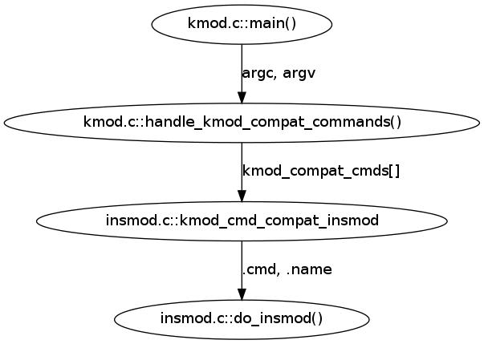

以下内容为分析6个命令的实现流程，为了做到重点突出，逻辑明晰，仅对每个命令实现代码中的第一层和第二层函数调用进行分析。
对于第三层的重要函数的实现分析，将放到核心代码分析章节中，不在本章节中展开。这样做的目的，主要是希望能够在有限的篇幅中，
把实现每个命令所调用的最重要的库函数接口体现出来，避免在繁冗复杂的函数接口列表中无重点的分析。

注意这个小节中后面的绝大部分代码都不是原代码的直接引用，而是将其中最核心的函数调用和传入传出的参数整理到函数体内部，为便于查看函数调用关系而做了简化。
因此可能有的变量没有清楚的定义，有的函数没有给出参数和返回值，也包括有的逻辑关系做了删减。但重要的调用关系都保留下来。

### insmod 命令实现流程

**do_insmod 核心代码分析**

分析到这里，我们就进入到了 insmod 命令实现最核心的部分 do_insmod() 函数，后面的其他几个命令也都是类似的方法，进入到 do_xxx() 中，之后的分析关于这部分不再赘述。下面我们来看看 do_insmod() 函数实现中最核心的部分代码摘要。

	do_insmod()
	{
		// 将 insmod 命令的参数传给 opts 指针
		opts = argv[x];	// name=value

		// 创建 kmod 库上下文
		ctx = kmod_new(NULL, &null_config);

		// 从路径名 path 创建 kmod module
		err = kmod_module_new_from_path(ctx, filename, &mod);

		// 插入 kmod module 单个文件，不包含依赖关系
		err = kmod_module_insert_module(mod, 0, opts);

		// 释放当前模块，给当前模块的引用计数减1
		kmod_module_unref(mod);

		// 释放 kmod 库上下文
		kmod_unref(ctx);
	}

do_insmod() 的实现可以分为5个步骤

* 创建模块的上下文 struct kmod_ctx ctx
* 通过 filename 和 ctx 获得模块 struct kmod_module mod
* 将 mod 插入到当前模块列表中, 通过 kmod_module_insert_module 完成真正的插入内核功能
* 释放 mod 
* 释放 ctx

涉及到两个模块的5个接口，两个模块是

* libkmod/libkmod.c
	- kmod_new() 
	- kmod_unref()
* libkmod/libkmod-module.c
	- kmod_module_new_from_path()
	- kmod_module_insert_module()
	- kmod_module_unref()

可以看出，这里真正最后完成插入操作的函数是 kmod_module_insert_module(mod, 0, opts);
这个函数在我们下面的函数接口分析中还会详细阐述。

### rmmod 命令实现流程

**do_rmmod 核心代码分析**

下面我们来看看 do_rmmod() 函数实现中最核心的部分代码摘要。

	do_rmmod()
	{
		//  打开日志文件, 调用了系统的 openlog()
		log_open(use_syslog);

		// 创建 kmod 库上下文 
		ctx = kmod_new(NULL, &null_config);

		// 设置 kmod log 日志输出的优先级
		log_setup_kmod_log(ctx, verbose);
		arg = argv[i];

		// 从路径名 path 创建 kmod module
		err = kmod_module_new_from_path(ctx, arg, &mod);
	
		// 从文件名 name 创建 kmod module
		err = kmod_module_new_from_name(ctx, arg, &mod);

		// 检查模块是否正在使用，通过引用计数来帮助判断是否真正需要卸载模块
		check_module_inuse(mod);

		// 卸载 kmod module 单个文件，不包含依赖关系
		err = kmod_module_remove_module(mod, flags);

		// 释放当前模块
		kmod_module_unref(mod);

		// 释放 kmod 库上下文
		kmod_unref(ctx);

		// 关闭日志文件，调用 closelog()
		log_close();
	}

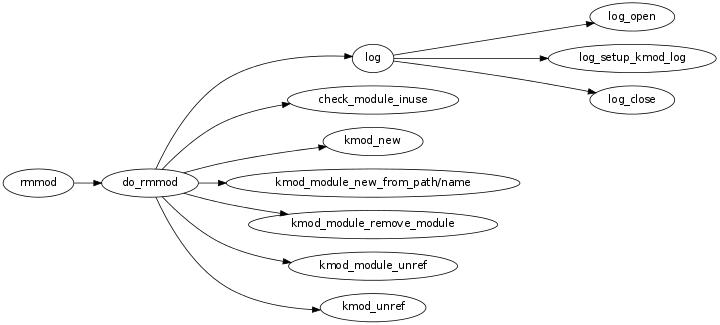

do_rmmod() 的实现相比 do_insmod() 的实现，主要是多了一个 log 的模块

* 打开日志 log
* 创建模块的上下文 struct kmod_ctx ctx
* 通过 path/name 和 ctx 获得模块 struct kmod_module mod
* 判别当前模块是否在使用中，如果在使用则不能卸载，释放相关资源后返回
* 如果不在使用中，则通过 kmod_module_remove_module 将 mod 从当前模块列表中卸载
* 释放 mod 
* 释放 ctx
* 关闭日志 log

涉及到3个模块的8个接口，3个模块和相关接口是

* libkmod/libkmod.c
	- kmod_new() 
	- kmod_unref()
* libkmod/libkmod-module.c
	- kmod_module_new_from_path()
	- kmod_module_insert_module()
	- kmod_module_unref()
* libkmod/tools/log.c
	- log_open()
	- log_close()
	- log_setup_kmod_log()

可以看出，这里真正最后完成插入操作的函数是 kmod_module_insert_module(mod, 0, opts);
这个函数在我们下面的函数接口分析中还会详细阐述。

### lsmod 命令实现流程

**do_lsmod() 核心代码分析**

	static int do_lsmod(int argc, char *argv[])
	{
		struct kmod_list *list, *itr;

		// 创建 kmod 库上下文
		ctx = kmod_new(NULL, &null_config);

		// 从 /proc/modules 文件创建 kmod module list	
		err = kmod_module_new_from_loaded(ctx, &list);
		puts("Module                  Size  Used by");

		// 遍历 list 链表，对每一个元素 itr 进行下面的操作
		kmod_list_foreach(itr, list) {
			// 从链表节点的数据区域 获得 kmod module 指针
		        struct kmod_module *mod = kmod_module_get_module(itr);
			// 从模块指针获得模块名
		        const char *name = kmod_module_get_name(mod);
			// 从模块指针获得模块引用计数
		        int use_count = kmod_module_get_refcnt(mod);
			// 从模块指针获得模块文件大小
		        long size = kmod_module_get_size(mod);

			printf("%-19s %8ld  %d ", name, size, use_count);
			// 从模块指针获得当前正在使用这个模块的模块列表 list
			holders = kmod_module_get_holders(mod);
		        kmod_list_foreach(hitr, holders) {
				// 从链表节点的数据区域 获得 kmod module 指针
		                struct kmod_module *hm = kmod_module_get_module(hitr);
				// 打印出当前这个 holder 的 name 
		                fputs(kmod_module_get_name(hm), stdout);
				// 释放当前模块
		                kmod_module_unref(hm);
		        }
		       	// 释放当前 holder 列表
			kmod_module_unref_list(holders);
			// 释放当前模块
		        kmod_module_unref(mod);
		}
		// 释放当前模块列表
		kmod_module_unref_list(list);
		// 释放当前库上下文
		kmod_unref(ctx);

		return EXIT_SUCCESS;
	}

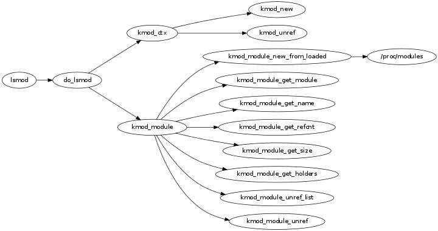

lsmod 命令的实现代码中，最重要的一个调用，就是 kmod_module_new_from_loaded，这个函数主要通过分析 /proc/modules 文件的输出，将已经加载到内存中的内核模块按照 kmod_list 的数据结构，依次添加到 list 链表中，完成 list 中数据的组装。

后面的实现部分，主要是通过 kmod_list_foreach 的宏，遍历整个链表，取出每一个模块 mod = kmod_module_get_module(itr)，获得模块的名字name, 引用计数refcnt，以及模块的大小size，把这3个最重要的信息打印出来，并按照一定的格式进行显示输出。

其中如果某个模块被其他别的模块正在使用，将会把这个 Use by 信息也打印出来，用逗号间隔。

举例：

	$ lsmod
	Module                  Size  Used by
	vmwgfx                102138  2 
	ttm                    65344  1 vmwgfx
	drm                   197692  3 vmwgfx,ttm

### modinfo 命令实现流程

**do_modinfo() 核心代码分析**

	static int do_modinfo(int argc, char *argv[])
	{
		// 创建 kmod 库上下文
		ctx = kmod_new(dirname, &null_config);
		
		// 可以支持同时在一条命令中查看多个模块的信息
		for (i = optind; i < argc; i++) {
		        const char *name = argv[i];
			// 如果当前给定的名字是 模块名 path ，则调用 modinfo_path_do
			// 如果当前给定的名字是 别名 alias ，则调用 modinfo_alias_do
		        if (is_module_filename(name))
		                r = modinfo_path_do(ctx, name);
		        else 
		                r = modinfo_alias_do(ctx, name);

		        if (r < 0)
		                err = r;
		}   

		// 释放当前库上下文
		kmod_unref(ctx);
		return err >= 0 ? EXIT_SUCCESS : EXIT_FAILURE;
	}

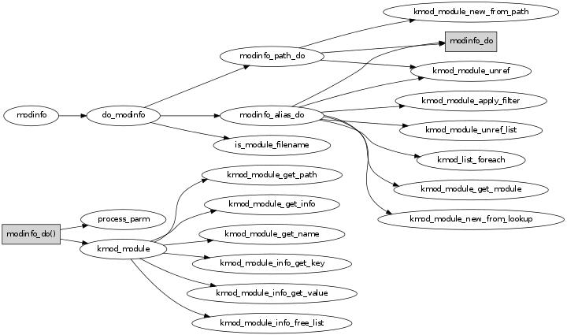

modinfo 命令中最重要的调用就是 modinfo_path_do 和 modinfo_alias_do ，这2个接口，其中前者是直接根据模块的绝对路径来找到模块文件并读出其中的相关信息，后者是通过 alias 别名来查找到所有别名为 alias 的模块（可能1个，也可能是很多个），通过 modules.alias 文件中的别名和真实文件名的对应关系，找到所有对应的模块文件，并逐一显示每一个模块的信息。有关于此的操作，在上面的 modinfo 命令运行时调试图小节中已经阐述过，这里不再赘述。

	static int modinfo_path_do(struct kmod_ctx *ctx, const char *path)
	{
		struct kmod_module *mod;
		// 从路径名 path 创建 kmod module
		int err = kmod_module_new_from_path(ctx, path, &mod);

		// 输出传入参数 mod 的 info 信息
		err = modinfo_do(mod);

		// 释放当前模块
		kmod_module_unref(mod);
		return err;
	}

	static int modinfo_alias_do(struct kmod_ctx *ctx, const char *alias)
	{
		struct kmod_list *l, *filtered, *list = NULL;

		// 从文件别名 alias 创建 kmod module list
		int err = kmod_module_new_from_lookup(ctx, alias, &list);
		
		// 对当前的 kmod module list 使用过滤器生成新的 list (filtered)
		err = kmod_module_apply_filter(ctx, KMOD_FILTER_BUILTIN, list, &filtered);

		// 删除 kmod list 链表 list 中的每一个节点
		kmod_module_unref_list(list);
		
		// 遍历新生成的 filtered 链表
		kmod_list_foreach(l, filtered) {

			// 从链表节点的数据区域 获得 kmod module 指针
		        struct kmod_module *mod = kmod_module_get_module(l);

			// 输出传入参数 mod 的 info 信息		        
			int r = modinfo_do(mod);

			// 释放当前模块
		        kmod_module_unref(mod);
		        if (r < 0)
		                err = r;
		}

		// 删除 kmod list 链表 filtered 中的每一个节点
		kmod_module_unref_list(filtered);
		return err;
	}

从上面的代码可以看出，通过 modinfo_path_do 只会找到一个 mod 进行输出，而通过 modinfo_alias_do 会根据 alias 找到一个 mod 的 list 然后逐一输出。无论那种方式，最终都是调用 modinfo_do 来对单个模块 mod 的信息进行输出，因此 modinfo_do 可以看成是实现 modinfo 命令的核心函数，从调用层次图中不难看出，这个函数主要使用了 kmod_module 模块提供的各种 get 功能调用来完成对模块信息的提取。

**modinfo_do() 核心代码分析**
该函数是实现 modinfo 命令的重要函数，模块信息的主要表示方式就是 key : value ，例如 author ： tsinghuaer

	static int modinfo_do(struct kmod_module *mod)
	{
		struct kmod_list *l, *list = NULL;
		struct param *params = NULL;
		
		// 从模块指针获得模块的完整路径名
		printf("%s%c", kmod_module_get_path(mod), separator);

		// 核心函数，获得所有信息 到 list 表中
		err = kmod_module_get_info(mod, &list);

		// 遍历整个 list 数组
		kmod_list_foreach(l, list) {
			// 获取 l-data->key 
		        const char *key = kmod_module_info_get_key(l);
			// 获取 l-data-value
		        const char *value = kmod_module_info_get_value(l);
		        
			process_parm(key, value, &params);
		  
		        printf("%s:%-*s%s%c", key, 15 - keylen, "", value, separator);
		}

		kmod_module_info_free_list(list);

		return err;
	}

在后面的核心代码分析章节中，我们会对这个函数 kmod_module_get_info 来进行详细的分析。

### depmod 命令实现流程

**do_depmod() 核心代码分析**

	do_depmod(int argc, char *argv[])
	{
		out = stdout;		
		ctx = kmod_new(cfg.dirname, &null_kmod_config);
		
		err = depmod_init(&depmod, &cfg, ctx);
		err = depmod_load_symvers(&depmod, module_symvers);
		err = depmod_load_system_map(&depmod, system_map);
		err = cfg_load(&cfg, config_paths);
		err = depmod_modules_search(&depmod);
		err = kmod_module_new_from_path(depmod.ctx, path, &mod);
		err = depmod_module_add(&depmod, mod);
		err = depmod_modules_build_array(&depmod);
		depmod_modules_sort(&depmod);
		err = depmod_load(&depmod);

		err = depmod_output(&depmod, out);
		depmod_shutdown(&depmod);
		cfg_free(&cfg);
		kmod_unref(ctx);
	}

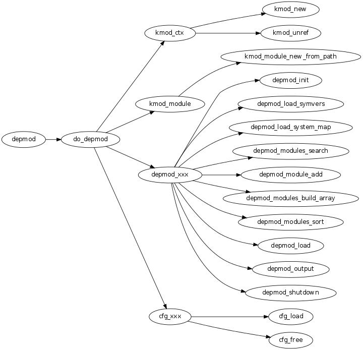

do_depmod() 的实现可以分为7个步骤

* 创建模块的上下文 struct kmod_ctx ctx
* 调用 depmod_xxx 接口，完成从 /lib/modules/`uname -r` 目录下找到所有模块
* 调用 kmod_module_new_from_path 接口，生成动态的 mod
* 调用 dep_module_add 和 dep_modules_build_array，生成数组 array
* 调用 dep_modules_sort 接口，对 array 进行排序
* 调用 depmod_output 接口，对排序后的结果，进行文件输出
* 释放相关的动态分配内存，结束 depmod 操作

下面根据这个核心代码，将在一层逻辑过程中调用到的函数，做一个简要的说明。
所有这些函数可以分为3类，分别形如 kmod_xxx，depmod_xxx, cfg_xxx 开头的。

**kmod_xxx**

包含 kmod_new, kmod_module_new_from_path, kmod_unref 这3个在之前的代码分析中介绍过。
其中用到了3个接口，分别是

* libkmod/libkmod.c
	- kmod_new() 
	- kmod_unref()
* libkmod/libkmod-module.c
	- kmod_module_new_from_path()

另外，在当前文件内部，还构建了两个新的子模块 depmod 和 cfg
* tools/depmod.c
	- depmod_xxx
	- cfg_xxx

**depmod_xxx**

这些函数都被声明为 static 的类型，说明仅仅只是为 depmod 命令的实现而服务的，不属于 libkmod 库要提供的接口。

* depmod 内部子模块上层接口
	- depmod_init
	- depmod_load_symvers
	- depmod_load_system_map
	- depmod_modules_search
	- depmod_module_add
	- depmod_modules_build_array
	- depmod_modules_sort
	- depmod_shutdown

围绕上面这些函数，还需要调用到如下接口

	static int depmod_init(struct depmod *depmod, struct cfg *cfg,
                                                        struct kmod_ctx *ctx)
	{
		array_init(&depmod->modules, 128);

		depmod->modules_by_uncrelpath = hash_new(512, NULL);
		depmod->modules_by_name = hash_new(512, NULL);
		depmod->symbols = hash_new(2048, (void (*)(void *))symbol_free);

		hash_free(depmod->modules_by_name);
		hash_free(depmod->modules_by_uncrelpath);

		return err;
	}

	static int depmod_load_symvers(struct depmod *depmod, const char *filename)
	{
		fp = fopen(filename, "r");
		while (fgets(line, sizeof(line), fp) != NULL) {
		ver = strtok(line, " \t");

		depmod_symbol_add(depmod, sym, crc, NULL);
		depmod_add_fake_syms(depmod);

		fclose(fp);
		return 0;
	}

	static int depmod_load_system_map(struct depmod *depmod, const char *filename)
	{
		fp = fopen(filename, "r");
		while (fgets(line, sizeof(line), fp) != NULL) {
		p = strchr(line, ' ');
		depmod_symbol_add(depmod, p + ksymstr_len, 0, NULL);
		depmod_add_fake_syms(depmod);
		fclose(fp);
		return 0;
	}

	static int depmod_modules_search(struct depmod *depmod)
	{
		DIR *d = opendir(depmod->cfg->dirname);
		err = depmod_modules_search_dir(depmod, d, baselen, path);
		closedir(d);
		return err;
	}

	static int depmod_module_add(struct depmod *depmod, struct kmod_module *kmod)
	{
		modname = kmod_module_get_name(kmod);

		mod = calloc(1, sizeof(struct mod) + modnamelen);

		array_init(&mod->deps, 4);

		err = hash_add_unique(depmod->modules_by_name, mod->modname, mod);

		return 0;
	}

	static int depmod_modules_build_array(struct depmod *depmod)
	{
		hash_iter_init(depmod->modules_by_name, &module_iter);

		while (hash_iter_next(&module_iter, NULL, &v)) {
		        struct mod *mod = (struct mod *) v;
		        mod->idx = depmod->modules.count;
		        err = array_append(&depmod->modules, mod);
		        if (err < 0)
		                return err;
		}
		return 0;
	}

	static void depmod_modules_sort(struct depmod *depmod)
	{
		snprintf(order_file, sizeof(order_file), "%s/modules.order",
				 depmod->cfg->dirname);
			fp = fopen(order_file, "r");

		while (fgets(line, sizeof(line), fp) != NULL) {
			mod = hash_find(depmod->modules_by_uncrelpath, line);
		}

		array_sort(&depmod->modules, mod_cmp);

		for (idx = 0; idx < depmod->modules.count; idx++) {
		        struct mod *m = depmod->modules.array[idx];
		        m->idx = idx;
		}
	}

	static void depmod_shutdown(struct depmod *depmod)
	{
		hash_free(depmod->symbols);

		hash_free(depmod->modules_by_uncrelpath);

		hash_free(depmod->modules_by_name);

		for (i = 0; i < depmod->modules.count; i++)
		        mod_free(depmod->modules.array[i]);

		array_free_array(&depmod->modules);

		kmod_unref(depmod->ctx);
	}

**cfg_xxx**

	static int cfg_load(struct cfg *cfg, const char * const *cfg_paths)
	{
		for (i = 0; cfg_paths[i] != NULL; i++)
		        cfg_files_list(&files, &n_files, cfg_paths[i]);

		for (i = 0; i < n_files; i++) {
		        struct cfg_file *f = files[i];
		        cfg_file_parse(cfg, f->path);
		        cfg_file_free(f);
		}
		free(files);

		if (cfg->searches == NULL)
		        cfg_search_add(cfg, "updates", 0);
	
		return 0;
	}
		      
	static void cfg_free(struct cfg *cfg)
	{
		while (cfg->overrides) {
		        struct cfg_override *tmp = cfg->overrides;
		        cfg->overrides = cfg->overrides->next;
		        cfg_override_free(tmp);
		}

		while (cfg->searches) {
		        struct cfg_search *tmp = cfg->searches;
		        cfg->searches = cfg->searches->next;
		        cfg_search_free(tmp);
		}
	}

在 depmod.c 文件的实现中，depmod_output 负责最后各类文件的输出功能。

	2161 static int depmod_output(struct depmod *depmod, FILE *out)
	2162 {
	2163         static const struct depfile {
	2164                 const char *name;
	2165                 int (*cb)(struct depmod *depmod, FILE *out);
	2166         } *itr, depfiles[] = {
	2167                 { "modules.dep", output_deps },
	2168                 { "modules.dep.bin", output_deps_bin },
	2169                 { "modules.alias", output_aliases },
	2170                 { "modules.alias.bin", output_aliases_bin },
	2171                 { "modules.softdep", output_softdeps },
	2172                 { "modules.symbols", output_symbols },
	2173                 { "modules.symbols.bin", output_symbols_bin },
	2174                 { "modules.builtin.bin", output_builtin_bin },
	2175                 { "modules.devname", output_devname },
	2176                 { }
	2177         };

其中输出到 /lib/modules/3.2.0-29-generic-pae/modules.dep 文件的输出函数是 output_deps
通过修改如下 fprintf(out, ...) 函数，增添输出到标准输出 stdout 的 fprintf(stdout, ...)
则可以在屏幕上看到运行 depmod 命令时候的全部输出结果，这个结果和 modules.dep 文件中的内容是完全一样的。

	1790 static int output_deps(struct depmod *depmod, FILE *out)
	1791 {
	1792         size_t i;
	1793 
	1794         for (i = 0; i < depmod->modules.count; i++) {
	1795                 const struct mod **deps, *mod = depmod->modules.array[i];
	...
	1804                 fprintf(out, "%s:", p);
	1805                 fprintf(stdout, "%s:", p);
	...
	1824                         fprintf(out, " %s", mod_get_compressed_path(d));
	1825                         fprintf(stdout, " %s", mod_get_compressed_path(d));
	...
	1828         end:
	1829                 putc('\n', out);
	1830                 putc('\n', stdout);
	... 
	1834 }

总的来说，depmod 命令的实现，并没有太多依赖于 libkmod 库所提供的接口，而是自己内部实现了2个子模块来完成。
其中 depmod_xxx 模块主要完成分析模块文件之间关系，形成依赖列表，并将这个依赖列表写入到所需要的文件中去。
cfg_xxx 模块主要完成对 config 配置文件的分析，

### modprobe 命令实现流程

**do_modprobe() 核心代码分析**

	do_modprobe(int argc, char *argv[])
	{
		log_open(use_syslog);

		snprintf(dirname_buf, sizeof(dirname_buf), "%s/lib/modules/%s", root, kversion);
		dirname = dirname_buf;

		ctx = kmod_new(dirname, config_paths);

		log_setup_kmod_log(ctx, verbose);
		kmod_load_resources(ctx);

		if (do_xxx)
			err = show_config(ctx);	
			err = show_modversions(ctx, args[0]);
			err = insmod_all(ctx, args, nargs);
			err = rmmod_all(ctx, args, nargs); 

		err = options_from_array(args, nargs, &opts);
		err = insmod(ctx, args[0], opts);

		kmod_unref(ctx);

		log_close();
	}

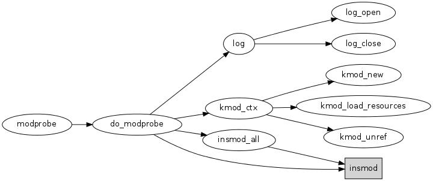

从上面的代码分析可以看出，modprobe 主要是依靠 insmod_all 和 insmod 两个子函数来完成加载内核模块的。
而 insmod_all 这个函数其实也是靠一个 for 循环来调用 insmod 完成加载全部模块的操作。
因此只要分析清楚 insmod 函数，就能够理解整个 modprobe 函数的实现原理。

#### insmod_all()
	static int insmod_all(struct kmod_ctx *ctx, char **args, int nargs)
	{
	        for (i = 0; i < nargs; i++) 
			err = insmod(ctx, args[i], NULL);

		return err;
	}

#### insmod()
	static int insmod(struct kmod_ctx *ctx, const char *alias,
		                                        const char *extra_options)
	{
		struct kmod_list *l, *list = NULL;
		int err, flags = 0;

		void (*show)(struct kmod_module *m, bool install,
		                                        const char *options) = NULL;

		err = kmod_module_new_from_lookup(ctx, alias, &list);
	   
		kmod_list_foreach(l, list) {
		        struct kmod_module *mod = kmod_module_get_module(l);

		        if (lookup_only)
		                printf("%s\n", kmod_module_get_name(mod));
		        else {
		                err = kmod_module_probe_insert_module(mod, flags,
		                                extra_options, NULL, NULL, show);
		        }

		        kmod_module_unref(mod);
		}

		kmod_module_unref_list(list);
		return err;
	}

从上面的代码分析可以看出，insmod 函数是依靠调用 kmod_module_probe_insert_module() 来完成模块加载的。
为什么这里的 insmod 没有调用之前分析过的 kmod_module_insert_module() 来实现呢？
是因为 kmod_module_insert_module() 只负责插入当前这个 .ko 内核模块，并不负责检查依赖关系。
而这里的 insmod 是需要根据当前 .ko 的依赖关系列表，决定要把多少个 .ko 依次一起插入进来。
所以 kmod_module_probe_insert_module() 是可以完成根据依赖关系插入模块的 libkmod 中的重要接口。

当然这两个函数之间也是有相互关系的，表现为 kmod_module_probe_insert_module() 函数会调用 kmod_module_insert_module()，
而在此之前，还需要通过 kmod_module_get_probe_list() 函数来得到一个 probe_list 也就是加载模块列表。

#### kmod_module_probe_insert_module
	int kmod_module_probe_insert_module(mod, flags, extra_options, run_install)
	{
		err = kmod_module_get_probe_list(mod, !!(flags & KMOD_PROBE_IGNORE_COMMAND), &list);
	
		kmod_list_foreach(l, list) 
		{
			struct kmod_module *m = l->data;
			err = kmod_module_insert_module(m, flags, options);
		}
	}

5. 函数接口分析
----------------

### kmod_new() 核心代码分析
kmod_new 函数通过调用 calloc 动态内存分配一个 struct kmod_ctx 结构体，并将获得的指针作为返回值。
在这个 ctx 结构体里面，有3个重要的成员变量需要赋值，dirname ，config 和 modules_by_name 分别对应着3个重要的函数接口。 

* get_kernel_release
* kmod_config_new
* hash_new

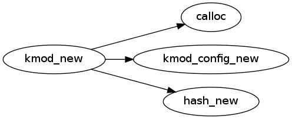

	kmod_ctx *kmod_new(char *dirname, char *config_paths)
	{
		// 分配空间给 ctx 指针
		ctx = calloc(1, sizeof(struct kmod_ctx));

		// 得到模块所在的路径名称
		ctx->dirname = get_kernel_release(dirname);

		// 通过传入2个参数 ctx, config_paths ，传出 ctx->config 指针
		err = kmod_config_new(ctx, &ctx->config, config_paths);

		// 调用 hash_new 分配一个 struct hash 指针
		ctx->modules_by_name = hash_new(KMOD_HASH_SIZE, NULL);

		return ctx;
	}

### kmod_unref() 核心代码分析
kmod_unref 是 kmod_new 的反操作，一般都是配套使用。该函数的主要功能是释放通过 callac 和 xxx_new 函数分配的空间。
和之前分配空间的函数相对应的，有2个释放空间的函数。另外还调用了 kmod_unload_resources 来释放相关资源。

* hash_free
* kmod_config_free

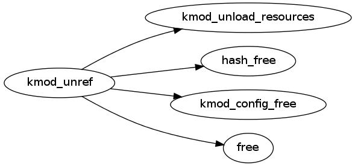

	kmod_ctx *kmod_unref(kmod_ctx *ctx)
	{
		// 释放 ctx 所占用的资源
		kmod_unload_resources(ctx);

		// 释放 struct hash * ctx->modules_by_name 指针内存空间 
		hash_free(ctx->modules_by_name);

		// 释放 struct kmod_config * ctx->config 指针内存空间 
		kmod_config_free(ctx->config);

		// 释放 struct kmod_ctx * ctx 指针内存空间 
		free(ctx);

		return NULL;
	}

### kmod_module_new_from_path() 核心代码分析
kmod_module_new_from_path 首先将传进来的 path 绝对路径转换为 modname 也就是去掉路径信息，然后进行正规化操作。
modname_normalize 正规化函数的实现，主要是将文件名称中的 ‘-’ 转换成下划线 ‘_' ，同时名字中不允许出现小数点 '.'。
	

	int kmod_module_new_from_path(kmod_ctx *ctx, char *path, kmod_module **mod)
	{
		// 从路径名称中分离出模块名称，例如 ./tools/insmod ../hello-module/hello.ko
		//  name='hello' path='/home/akaedu/Github/test-kmod-11/kmod-11/../hello-module/hello.ko'
		path_to_modname(path, name, &namelen);

		// 从 name 名称中得到指向该模块的指针 m
		m = kmod_pool_get_module(ctx, name);

		// 增加该模块的引用计数
		kmod_module_ref(m);

		// 根据 name 创建一个新的模块
		err = kmod_module_new(ctx, name, name, namelen, NULL, 0, &m); 
		
		// 将模块指针 m 作为返回值通过 *mod 返回
		*mod = m;
		return 0;
	}

	157 // 详见 kmod-11/libkmod/libkmod-util.c 
	158 char *path_to_modname(const char *path, char buf[PATH_MAX], size_t *len)
	159 {
	160         char *modname;
	161 
	162         modname = basename(path);
	163         if (modname == NULL || modname[0] == '\0')
	164                 return NULL;
	165 
	166         return modname_normalize(modname, buf, len);
	167 }

	133 // 详见 kmod-11/libkmod/libkmod-util.c 
	134 inline char *modname_normalize(const char *modname, char buf[PATH_MAX],
	135                                                                 size_t *len)
	136 {
	137         size_t s;
	138 
	139         for (s = 0; s < PATH_MAX - 1; s++) {
	140                 const char c = modname[s];
	141                 if (c == '-')
	142                         buf[s] = '_';
	143                 else if (c == '\0' || c == '.')
	144                         break;
	145                 else
	146                         buf[s] = c;
	147         }
	148 
	149         buf[s] = '\0';
	150 
	151         if (len)
	152                 *len = s;
	153 
	154         return buf;
	155 }

### kmod_module_new_from_name() 核心代码分析
kmod_module_new_from_name 是首先把模块的名字进行正规化，然后调用 kmod_module_new 来完成最终的操作。

	KMOD_EXPORT int kmod_module_new_from_name(struct kmod_ctx *ctx,
		                                        const char *name,
		                                        struct kmod_module **mod)
	{
		size_t namelen;
		char name_norm[PATH_MAX];

		if (ctx == NULL || name == NULL || mod == NULL)
		        return -ENOENT;

		// 模块名称的正规化操作
		modname_normalize(name, name_norm, &namelen);

		// 最终还是依靠调用 kmod_module_new 完成模块的创建操作
		return kmod_module_new(ctx, name_norm, name_norm, namelen, NULL, 0, mod);
	}

### kmod_module_new() 核心代码分析
kmod_module_new 函数是通过传入的 key，name 和 alias 以及 ctx 指针，通过 malloc 生成一个 kmod_module ，并将指针作为传出参数赋值给 *mod。
其中涉及到的几个函数调用接口的实现主要都在 ./kmod-11/libkmod/libkmod.c 文件中，代码实现的主要思路如下：

* kmod_pool_get_module(ctx, key)
	- hash_find(ctx->modules_by_name, key)
* kmod_pool_add_module(ctx, m, m->hashkey)
	- hash_add(ctx->modules_by_name, m, m->hashkey)
* kmod_ref(ctx)
	- ctx->refcount++

在这里就不详细论述，感兴趣的可以再往深入的地方看下去。

	static int kmod_module_new(struct kmod_ctx *ctx, const char *key,
		                        const char *name, size_t namelen,
		                        const char *alias, size_t aliaslen,
		                        struct kmod_module **mod)
	{
		struct kmod_module *m;
		size_t keylen;

		// 从 kmod pool 中通过 hash_find 获取模块指针 m
		m = kmod_pool_get_module(ctx, key);
		*mod = kmod_module_ref(m);
		
		// 通过 malloc 分配一个 struct module 结构体
		m = malloc(sizeof(*m) + (alias == NULL ? 1 : 2) * (keylen + 1));
		m->ctx = kmod_ref(ctx);
		m->name = (char *)m + sizeof(*m);
		memcpy(m->name, key, keylen + 1);
		        
		m->name[namelen] = '\0';
		m->alias = m->name + namelen + 1;
		m->hashkey = m->name + keylen + 1;
		memcpy(m->hashkey, key, keylen + 1);

		// 设置当前模块 m 的引用计数为 1
		m->refcount = 1;

		// 在 kmod 池中通过 hash_add 添加一个键值为 m-hashkey 的模块
		kmod_pool_add_module(ctx, m, m->hashkey);
		*mod = m;

		return 0;
	}

### kmod_module_insert_module() 核心代码分析
该函数是实现 insmod 命令最核心的函数，实现代码的逻辑结构非常清晰。主要涉及到了2个核心模块 kmod_file, kmod_elf ，也正是在这个函数的实现中，简单而又不失重要性的展示了 命令 -> 库 -> 系统调用 这3个层次上的相互调用关系，程序设计的分层艺术也非常完美的体现在这个函数中。

	int kmod_module_insert_module(kmod_module *mod, int flags, char *options)
	{
		// 从模块指针获得模块的完整路径名
		path = kmod_module_get_path(mod);

		// 通过模块的上下文和完整的路径，打开这个文件, 将文件内容读出到 ctx 结构体中
		file = kmod_file_open(mod->ctx, path);

		// 获得文件大小
		size = kmod_file_get_size(file);

		// 获得文件内容指针 memory
		mem = kmod_file_get_contents(file);

		// 创建一个 struct kmod_elf 结构体并将 size, offset, section.count 填入
		elf = kmod_elf_new(mem, size);

		// 对 __versions 进行 strip,去掉有关版本版本信息，此项操作针对 -force 选项
		kmod_elf_strip_section(elf, "__versions");

		// 获得 elf 文件的 memory 指针
		mem = kmod_elf_get_memory(elf);

		// 进行系统调用 init_module 完成真正的模块插入
		init_module(mem, size, args);

		// 释放之前分配的内存资源
		kmod_elf_unref(elf);
		kmod_file_unref(file);
	}

### kmod_module_remove_module() 核心代码分析
该函数是实现 rmmod 的最主要的函数，它的实现也很简单，就是调用 delete_module 系统调用。

	int kmod_module_remove_module(kmod_module *mod, int flags)
	{
		err = delete_module(mod->name, flags);

		return err;
	}

### init_module() 核心代码分析
在 kmod_module_insert_module 函数中调用的 init_module 系统调用，将会在进入到内核之后完成真正的加载操作。
用户空间的系统调用叫 init_module ，在内核空间这个系统调用的实现主要是依靠 sys_init_module 函数完成的。

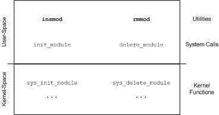

内核模块的加载，本质上是一个模块被内核静态链接的过程，sys_init_module 函数可以分为以下关键步骤：

* 调用内核空间的 load_module 函数，然后通过 copy_from_user 把 ELF 内容读入到内核临时空间做一个映像分析
* 对加载的 ELF 映像进行分析，确定要加载哪些段进入到真正代码空间
* 为要加载的每一个段进行重新定位，最终完成加载，插入到内核中，成为内核符号表的一部分

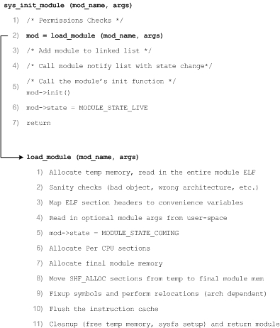

在 kmod-11 项目中，在 testsuite/ 目录下有一个 init_module.c ，里面也实现了一个 init_module 的函数，
它的功能主要是在用户空间模拟内核加载，来进行调试和分析，并不是真正的加载模块。

从下面的代码分析可以看出，这个“假的” init_module 实际上是通过 create_sysfs_files 创建系统文件来表明模块已经完成插入工作。

	long init_module(void *mem, unsigned long len, const char *args)
	{
		kmod_elf *elf = kmod_elf_new(mem, len);

		err = kmod_elf_get_section(elf, ".gnu.linkonce.this_module", &buf, &bufsize);
		kmod_elf_unref(elf);
		mod = find_module(modules, modname);
		if(mod != NULL)
		{ 
		} else if (module_is_inkernel(modname))
		{
		} else 	// 通过创建文件的方法来表示当前模块已经插入
			create_sysfs_files(modname);

		return err;
	}

### delete_module() 核心代码分析
在 kmod_module_remove_module 函数中调用的 delete_module 系统调用，将会在进入到内核之后完成真正的卸载操作。
用户空间的系统调用叫 delete_module ，在内核空间这个系统调用的实现主要是依靠 sys_delete_module 函数完成的。

内核模块的加载，和加载过程基本相反，sys_delete_module 函数可以分为以下关键步骤：

* 首先检查模块的依赖关系，看是否还有其他模块依赖于这个模块，如果没有则可以卸载这个模块
* 然后调用模块的 exit 函数，最后调用内核空间的 free_module 函数
* 在 free_module 函数中，开始完成对该模块在系统文件、模块列表中的清除工作
* 释放为该模块分配的各种内存，最终完成卸载该模块的操作

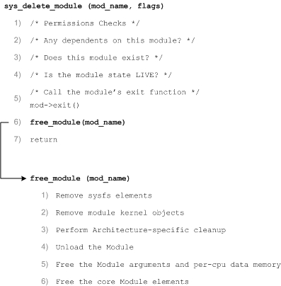

在 kmod-11 项目中，在 testsuite/ 目录下有一个 delete_module.c ，里面也实现了一个 delete_module 的函数，
同样的，它也并不是真正的卸载模块，仅仅只是查找一下当前模块，并不执行实际的删除操作。

	long delete_module(void *mem, int flags)
	{
		struct mod *mod;

		mod = find_module(modules, modname);

		return mod->ret;
	}

* 参考文档 

<https://www.ibm.com/developerworks/cn/linux/l-lkm/>

<http://hi.baidu.com/youngky2008/item/8e6a51fe76b45551c9f337a9>

### kmod_module_unref() 核心代码分析
该函数是 kmod_module_new 操作的反操作，主要功能是释放 new 函数中分配的内存空间。
通过调用 kmod_pool_del_module 在 kmod_pool 池中删除该模块的hash键值。
同时减少对该模块的引用计数 --mod->refcount; 如果减1后计数为0，则需要彻底将该模块从内核中清除。

首先，把它从 kmod_pool 中删除 kmod_pool_del_module(mod->ctx, mod, mod->hashkey);
对于该模块所依赖的模块列表中的所有模块的引用计数也需要进行减1操作 kmod_module_unref_list(mod->dep)。
释放该模块对应的 kmod_file 也就是 kmod_file_unref(mod->file);
释放该模块对应的 kmod_ctx 也就是 kmod_unref(mod->ctx);

	kmod_module *kmod_module_unref(kmod_module *mod)
	{
		// 减少模块的引用计数,如果已经减到0，则卸载该模块
		--mod->refcount;
		
		//  在 kmod 池中通过 hash_add 删除一个键值为 key 的模块
		kmod_pool_del_module(mod->ctx, mod, mod->hashkey);

		// 删除 kmod list 链表中的每一个节点
		kmod_module_unref_list(mod->dep);

		// 释放文件资源，关闭当前文件描述符
		kmod_file_unref(mod->file);

		// 释放 kmod 库上下文
		kmod_unref(mod->ctx);

		return NULL;
	}

### kmod_module_new_from_loaded 核心代码分析
该函数是实现 lsmod 命令的重要函数，通过读取 /proc/modules 文件的每一行，构建一个 kmod_list 列表，然后给 *list 赋值作为传出参数返回。
通过 cat 命令，查看 /proc/modules 文件的内容，格式不是很整齐，排列参差不齐。通过 lsmod 命令输出的信息，格式对齐，看起来信息也比较清晰。

	KMOD_EXPORT int kmod_module_new_from_loaded(struct kmod_ctx *ctx,
							struct kmod_list **list)
	{
		struct kmod_list *l = NULL;
		FILE *fp;
		char line[4096];

		// 打开 /proc/modules 系统内存文件
		fp = fopen("/proc/modules", "re");
		
		// 读取1行进行分析
		while (fgets(line, sizeof(line), fp)) {
			struct kmod_module *m;
			struct kmod_list *node;
			int err;

			// 以空格和\t（tab键）作为间隔token，依次读取每个字段
			char *saveptr, *name = strtok_r(line, " \t", &saveptr);

			// 通过读的名字进行创建 kmod_module m
			err = kmod_module_new_from_name(ctx, name, &m);

			// 将创建的 m 插入到 kmod_list l 中
			node = kmod_list_append(l, m);
			if (node)
				l = node;
			else {
				ERR(ctx, "out of memory\n");
				kmod_module_unref(m);
			}
		}

		// 关闭文件fp指针
		fclose(fp);

		// 将 kmod_list l 作为链表头返回
		*list = l;

		return 0;
	}

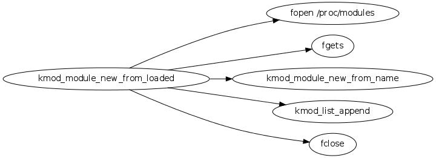

### kmod_module_get_info 核心代码分析
该函数的主要功能是 获取当前模块 mod 的 info 信息(.modinfo字段)，组装成一个 list 返回。

举例：
	$ ./kmod-11/tools/modinfo ./hello-module/hello.ko 

	key = license=GPL
	key = description=module example 
	key = author=AKAEDU
	key = srcversion=49A755BEBF4FF5E99BDBD01
	key = depends=
	key = vermagic=3.2.0-29-generic-pae SMP mod_unload modversions 686 

	struct kmod_module_info {
		char *key;
		char value[];
	};

	KMOD_EXPORT int kmod_module_get_info(const struct kmod_module *mod, struct kmod_list **list)
	{
		char **strings;

		// 返回当前模块 mod 的 kmod_file 指针
		elf = kmod_module_get_elf(mod);

		// 获得名为 .modinfo 字段的字符串数组的 string 并分配空间用来存放，返回值为string数组元素个数
		count = kmod_elf_get_strings(elf, ".modinfo", &strings);

		for (i = 0; i < count; i++) {
			struct kmod_module_info *info;
				
			// 获得 string 数组中的每一个字符串指针，赋值给 key
			key = strings[i];
			printf("key = %s\n", key);
			value = strchr(key, '=');

			// 生成 kmod_module_info 结构体，将传入参数填入，返回结构体指针
			info = kmod_module_info_new(key, keylen, value, valuelen);

			// 在当前 kmod list 的后面，新增一个节点 node，数据为 info 指针
			n = kmod_list_append(*list, info);	
		}

		// 释放 string 数组
		free(strings);
	}

### kmod_module_new_from_lookup 核心代码分析
该函数主要用于在 modprobe 中插入模块前所使用，根据用户给出的 alias 来完成构建 kmod_list 的操作，最后给 *list 赋值作为传出参数返回。
完成构建需要查找名为 alias 的全部模块，一旦在某个地方找到，就不再继续寻找而是创建并将模块保存在 *list 中。

该函数中，模块查找的顺序是

* 在配置文件中 (/etc/modprobe.d/modules.conf）的 alias 是最先寻找的，它的设置将会覆盖其他地方的设置。 
* 接下来的顺序是，在 modules.dep -> modules.symbols -> commands -> modules.alias -> modules.buildin

下面是这个函数实现的核心代码

	KMOD_EXPORT int kmod_module_new_from_lookup(struct kmod_ctx *ctx,
							const char *given_alias,
							struct kmod_list **list)
	{
		int err;
		char alias[PATH_MAX];
		if (alias_normalize(given_alias, alias, NULL) < 0) {
			DBG(ctx, "invalid alias: %s\n", given_alias);
			return -EINVAL;
		}

		/* Aliases from config file override all the others */
		err = kmod_lookup_alias_from_config(ctx, alias, list);

		err = kmod_lookup_alias_from_moddep_file(ctx, alias, list);
		err = kmod_lookup_alias_from_symbols_file(ctx, alias, list);
		err = kmod_lookup_alias_from_commands(ctx, alias, list);
		err = kmod_lookup_alias_from_aliases_file(ctx, alias, list);
		err = kmod_lookup_alias_from_builtin_file(ctx, alias, list);
		
		return err;
	}

### kmod_module_probe_insert_module
该函数主要用于在 modprobe 时真正完成 probe insert 操作，这个函数最终还是要调用 kmod_module_insert_module 函数来实现插入操作。
所不同的是，在插入之前需要生成一个 probe_list ，这个链表是用来标明 probe 一共需要插入的模块有多少，而且保证按照依赖关系从弱到强的顺序排列。

其中 kmod_module_get_probe_list 是整个 modprobe 操作中最难部分，体现为需要从 depmod 命令生成的 modules.dep 文件中，读取该模块的依赖关系列表。
并由此生成一个 list ，用于之后通过这个 list 来依次插入每一个所需要的内核模块。

	int kmod_module_probe_insert_module(mod, flags, extra_options, run_install)
	{
		// 从 modules.dep 文件中，读取该模块的依赖关系列表		
		err = kmod_module_get_probe_list(mod, !!(flags & KMOD_PROBE_IGNORE_COMMAND), &list);
	
		kmod_list_foreach(l, list) 
		{
			struct kmod_module *m = l->data;
			// 对于链表中的每一个module，依次调用 insert 加载
			err = kmod_module_insert_module(m, flags, options);
		}
	}

这个 kmod_module_get_probe_list 函数的调用流程比较复杂，下面这个图是跟踪函数执行的关键调用，最后到底层发现是通过 kmod_module_parse_depline 来解析 modules.dep 文件中的包含依赖关系的那行（字符串），然后分离出当前模块依赖的每一个模块的path，然后仍然是通过直接最核心 kmod_module_new_from_path 函数来完成所有涉及到的模块加载。

	-> kmod_module_get_probe_list
		-> __kmod_module_get_probe_list
			-> kmod_module_get_dependencies
				->  module_get_dependencies_noref
					-> kmod_module_parse_depline

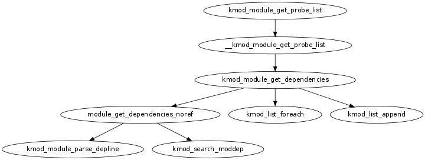

#### kmod_module_get_dependencies 核心代码分析
	kmod_list *kmod_module_get_dependencies(struct kmod_module *mod)
	{
		// 找到当前 mod 的依赖关系模块，添加到 mod->dep 的 kmod_list 指针上去
		module_get_dependencies_noref(mod);

		// 遍历整个 mod->dep 链表，找出每一个节点模块
		kmod_list_foreach(l, mod->dep)
		{
			// 调用 kmod_list_append 把其中的字符串，添加到一个新的链表上
			l_new = kmod_list_append(list_new, kmod_module_ref(l->data));
			list_new = l_new;
		}

		return list_new;
	}

#### module_get_dependencies_noref 核心代码分析
找到 mod->name 所在的行，得到该模块的依赖关系字符串到 line 中，然后对这个 line 进行 parse 操作，获得每一个依赖模块逐一加载。

举例：
	$ ./kmod-11/tools/modprobe nfs

	line = kernel/fs/nfs/nfs.ko: kernel/fs/nfs_common/nfs_acl.ko kernel/net/sunrpc/auth_gss/auth_rpcgss.ko kernel/fs/fscache/fscache.ko kernel/fs/lockd/lockd.ko kernel/net/sunrpc/sunrpc.ko

	kmod_list *module_get_dependencies_noref(struct kmod_module *mod)
	{
		// 通过模块名 mod->name 找到表示当前模块 mod 依赖关系的字符串 line
		char *line = kmod_search_moddep(mod->ctx, mod->name);

		// 分析字符串 line，建立一个关于依赖关系的 kmod_list，赋值给 mod->dep
		kmod_module_parse_depline(mod, line);

		return mod->dep;
	}

#### kmod_search_moddep 核心代码分析
该函数是实现从模块名字到模块依赖关系字符串的转换，简单来说就是实现 name -> line 的转换。

举例 modprobe nfs 命令中，name = nfs，找到的字符串就是

	kernel/fs/nfs/nfs.ko: kernel/fs/nfs_common/nfs_acl.ko kernel/net/sunrpc/auth_gss/auth_rpcgss.ko kernel/fs/fscache/fscache.ko kernel/fs/lockd/lockd.ko kernel/net/sunrpc/sunrpc.ko

	char *kmod_search_moddep(struct kmod_ctx *ctx, const char *name)
	{
		// 通过 index 模块的索引，找到 名字为 name 的字符串行
		return index_mm_search(ctx->indexes[KMOD_INDEX_MODULES_DEP], name);
		
		DBG(ctx, "file=%s modname=%s\n", fn, name);

		idx = index_file_open(fn);
		line = index_search(idx, name);
		index_file_close(idx);

		return line;
	}

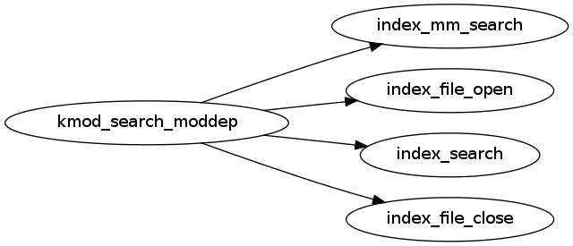

#### kmod_module_parse_depline 核心代码分析
从 line 中根据冒号作为间隔符，冒号左边是要加载的模块，冒号右边是依赖关系列表，列表中的各个模块是以 path 的方式存储的，两个之间用空格或者 \t 间隔，因此需要通过 strtok 函数来依次获得每一个模块的字符串，通过这个字符串 path，调用 kmod_module_new_from_path 来得到一个 kmod_list。

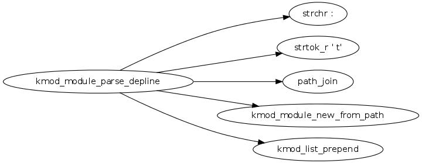

举例：

	$ ./kmod-11/tools/modprobe nfs

	line = kernel/fs/nfs/nfs.ko: kernel/fs/nfs_common/nfs_acl.ko kernel/net/sunrpc/auth_gss/auth_rpcgss.ko kernel/fs/fscache/fscache.ko kernel/fs/lockd/lockd.ko kernel/net/sunrpc/sunrpc.ko

	p = kernel/fs/nfs_common/nfs_acl.ko
	
	p = kernel/net/sunrpc/auth_gss/auth_rpcgss.ko
	
	p = kernel/fs/fscache/fscache.ko
	
	p = kernel/fs/lockd/lockd.ko
	
	p = kernel/net/sunrpc/sunrpc.ko

	int kmod_module_parse_depline(struct kmod_module *mod, char *line)
	{
		p = strchr(line, ':');

		for (p = strtok_r(p, " \t", &saveptr); p != NULL;
			 p = strtok_r(NULL, " \t", &saveptr)) 
		{
			path = path_join(p, dirnamelen, buf);

			err = kmod_module_new_from_path(ctx, path, &depmod);
			list = kmod_list_prepend(list, depmod);
			n++;
		}

		mod->dep = list;
		mod->n_dep = n;

		return n;
	}

5. 总结
----------------
kmod-11 的项目分析，对于我们未来设计类似的软件架构，有如下启示：

1）kmod-11 采用了 libabc 的库项目框架，这个项目是一个开源项目，项目的参考代码可以在 github 上找到。

https://github.com/bitbckt/libabc 

https://git.kernel.org/cgit/linux/kernel/git/kay/libabc.git

libabc 项目发源于2002年，在2011年发布了 version 4。目前最近一次提交是2013.3.11。

整个项目的框架和目前我们所分析的，有很多类似的地方。特别是 ctx 环境上下文这个数据结构的引入。

我们可以看一个来自 libabc 中的简单的例子 test-libabc.c。

	#include <libabc.h>

	int main(int argc, char *argv[])
	{
		struct abc_ctx *ctx;
		struct abc_thing *thing = NULL;
		int err;

		err = abc_new(&ctx);
		if (err < 0)
			exit(EXIT_FAILURE);

		printf("version %s\n", VERSION);

		err = abc_thing_new_from_string(ctx, "foo", &thing);
		if (err >= 0)
			abc_thing_unref(thing);

		abc_unref(ctx);
		return EXIT_SUCCESS;
	}

2) 基础类的数据结构和算法，是写一个大型项目所必须具备的知识储备。

在 kmod-11 项目中，6个基础类的子模块，

* hash 哈希表模块
* list 链表模块
* array 动态数组模块
* index_mm 索引查找模块
* log 日志记录模块
* elf 文件分析模块

这几个模块并非是 kmod 项目所独有的，完全可以作为未来开发项目的基础类库得以复用。

3) 系统调用模拟层的设计理念。因为内核模块会经常需要和内核打交道，无论插入和删除，一不小心可能会造成内核崩溃，只能靠 reset 重启来进行调试。因此引入关于系统调用函数的应用层实现，就可以在用户空间模拟系统调用后发生的行为，进行调试和验证。

