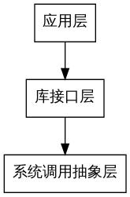
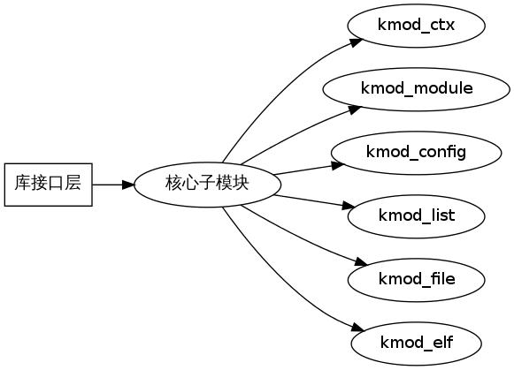
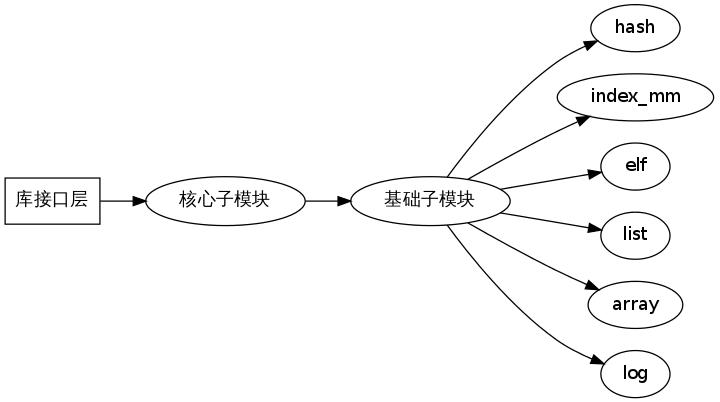
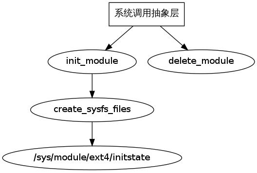
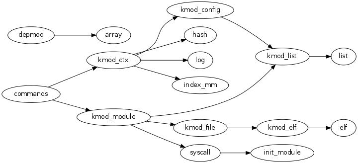
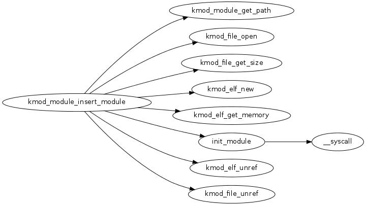
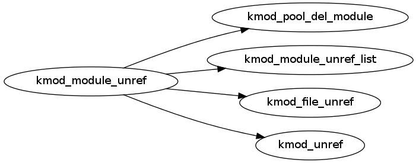

kmod-Linux内核模块工具
======================

1. 项目背景分析
----------------

kmod 是为了能够操作 Linux 内核模块而推出的一系列工具集，这些操作包括 插入（insert），删除（remove），列出（list），检查属性（check properties）和解决依赖关系（dependencies）。

这些工具在底层都需要用到 libkmod 这个库，相关的源码也会跟着 kmod 项目一同发布。这个项目的目标是能够实现与在此之前 module-init-tools 项目所提供的工具兼容。

### 项目建立时间
从 git.kernel.org 上的 commit log 分析，该项目的建立时间是 2011-11-21。最初的项目是通过继承了 libabc 的框架开始逐步演变而来。2011-12-15 发布了 kmod 1 版本。

参考*项目主页*  
<http://git.kernel.org/cgit/utils/kernel/kmod/kmod.git>

### 项目创建者和维护者
创建者是 Lucas De Marchi。这个人就职于巴西 Brazil Campinas 的一家公司ProFUSION Embedded Systems（该公司的主页http://profusion.mobi/），从他在 github 个人项目的帐号创建时间看是 2008年10月30号，应该是属于比较早期的 github 用户。

参考*个人主页*  
<https://github.com/lucasdemarchi>

### 项目更新记录
项目最近一次提交 commit log 表明，该项目近期处于一个比较活跃的状态。从 2013-4-9 发布了最新的 kmod 13 版本之后，该项目几乎每隔1，2天有一次或多次提交。最近的一次提交是 2013-4-17，主要的贡献者仍然是 Lucas De Marchi。

参考*提交记录*  
<http://git.kernel.org/cgit/utils/kernel/kmod/kmod.git/log/>

### 项目版本情况
第一个可以下载的软件包 kmod-1.tar.gz 是2012-2-24 上传的，最新的软件包 kmod-13.tar.gz 是 2013-4-9 上传的。

目前 kmod 已经发布到了第13个版本，从项目 NEWS 中可以看到，项目从版本 1 就开始支持原来的 insmod/rmmod/lsmod/modprobe 这几个常用命令，发展至今libkmod 库已经提供了100多个函数接口用于方便用户管理内核模块。

### 项目资源汇总
* 代码下载  
	<https://www.kernel.org/pub/linux/utils/kernel/kmod>

* 邮件列表  
	<linux-modules@vger.kernel.org>

* Git项目仓库  
	git://git.kernel.org/pub/scm/utils/kernel/kmod/kmod.git  
	<https://git.kernel.org/pub/scm/utils/kernel/kmod/kmod.git>

* Gitweb页面  
	<http://git.kernel.org/?p=utils/kernel/kmod/kmod.git>

2. 项目技术分析
---------------

### 开发环境准备
* 首先需要安装如下的软件工具
	- GCC compiler 编译工具
	- GNU C library 标准C库
	- autoconf 自动化配置工具，可以生成项目所需的 makefile
	- shtool 一个兼容之前类似 mkdir.sh/install.sh 的shell脚本工具
	- libtool 制作可生成依赖关系的共享库，生成文件后缀名为 .la, lo
	- xsltproc 快速XSLT引擎，可以通过XSL层叠样式表把XML转换为其他格式，例如html/pdf

* 可选的依赖关系:
	- ZLIB library
	- LZMA library
	
### 编译和安装
	$ sudo apt-get install autoconf 
	$ sudo apt-get install shtool 
	$ sudo apt-get install libtool
	$ sudo apt-get install xsltproc 

	$ aclocal
	$ autoconf
	$ ./configure CFLAGS="-g -O2" --prefix=/usr --sysconfdir=/etc --libdir=/usr/lib
	$ make && make install

### 错误及解决
代码编译过程会出现不少问题，但都可以通过安装和配置逐一解决。现对编译过程中的问题做一总结：

**1）autoconf 缺少环境变量文件**

 	$ autoconf 
	configure.ac:10: error: possibly undefined macro: AM_INIT_AUTOMAKE
	      If this token and others are legitimate, please use m4_pattern_allow.
	      See the Autoconf documentation.
	configure.ac:28: error: possibly undefined macro: AM_PROG_CC_C_O
	configure.ac:89: error: possibly undefined macro: AM_CONDITIONAL
	$ aclocal

通过 aclocal 命令生成，获取当前系统的环境变量，生成一个 aclocal.m4 文件。

**2）configure 脚本执行时缺少 libtool 工具**

	$ ./configure CFLAGS="-g -O2" --prefix=/usr --sysconfdir=/etc --libdir=/usr/lib
	configure: error: cannot find install-sh, install.sh, or shtool in build-aux "."/build-aux
	$ autoreconf -f -i -Wall,no-obsolete
	Can't exec "libtoolize": No such file or directory at /usr/bin/autoreconf line 196.
	Use of uninitialized value in pattern match (m//) at /usr/bin/autoreconf line 196.
	$ sudo apt-get install libtool

通过 sudo apt-get 安装解决。

**3）configuire 脚本执行缺少 xsltproc 命令**

	$ ./configure CFLAGS="-g -O2" --prefix=/usr --sysconfdir=/etc --libdir=/usr/lib
	configure: error: xsltproc command not found, try ./configure --disable-manpages
	$ sudo apt-get install xsltproc 

通过 sudo apt-get 安装解决，成功之后，会在当前目录下生成 Makefile 文件。

### 编译过程
编译过程总体比较顺利，执行 make 和 make install 命令即可完成。

	$ make
	make --no-print-directory all-recursive
	Making all in .
	  CC     libkmod/libkmod.lo
	  CC     libkmod/libkmod-list.lo
	  CC     libkmod/libkmod-config.lo
	  CC     libkmod/libkmod-index.lo
	  CC     libkmod/libkmod-module.lo
	  CC     libkmod/libkmod-file.lo
	  CC     libkmod/libkmod-elf.lo
	  CC     libkmod/libkmod-signature.lo
	  CC     libkmod/libkmod-hash.lo
	  CC     libkmod/libkmod-array.lo
	  CC     libkmod/libkmod-util.lo
	  CCLD   libkmod/libkmod-util.la
	  CCLD   libkmod/libkmod.la
	  CCLD   libkmod/libkmod-private.la
	  CC     tools/kmod.o
	  CC     tools/lsmod.o
	  CC     tools/rmmod.o
	  CC     tools/insmod.o
	  CC     tools/modinfo.o
	  CC     tools/modprobe.o
	  CC     tools/depmod.o
	  CC     tools/log.o
	  CC     tools/static-nodes.o
	  CCLD   tools/kmod
	  CCLD   tools/kmod-nolib
	  GEN    tools/insmod
	  GEN    tools/rmmod
	  GEN    tools/lsmod
	  GEN    tools/modprobe
	  GEN    tools/modinfo
	  GEN    tools/depmod
	  GEN    libkmod/libkmod.pc
	Making all in libkmod/docs
	make[2]: Nothing to be done for `all'.
	Making all in man
	  GEN    depmod.d.5
	  GEN    modprobe.d.5
	  GEN    modules.dep.5
	  GEN    depmod.8
	  GEN    insmod.8
	  GEN    lsmod.8
	  GEN    rmmod.8
	  GEN    modprobe.8
	  GEN    modinfo.8

由以上编译过程可知，项目主要架构分为2层，上层为 tools 目录下提供的各种工具（兼容之前的命令集，例如 insmod/rmmod），下层为 libkmod 目录下生成的 libkmod.la，为上层工具提供所需要的库函数。

### 生成文件
	$ ls tools/ -l | grep x
	lrwxrwxrwx 1 akaedu akaedu     10 Apr 17 04:43 depmod -> kmod-nolib
	lrwxrwxrwx 1 akaedu akaedu     10 Apr 17 04:43 insmod -> kmod-nolib
	-rwxrwxr-x 1 akaedu akaedu   8385 Apr 17 04:43 kmod
	-rwxrwxr-x 1 akaedu akaedu 488644 Apr 17 04:43 kmod-nolib
	lrwxrwxrwx 1 akaedu akaedu     10 Apr 17 04:43 lsmod -> kmod-nolib
	lrwxrwxrwx 1 akaedu akaedu     10 Apr 17 04:43 modinfo -> kmod-nolib
	lrwxrwxrwx 1 akaedu akaedu     10 Apr 17 04:43 modprobe -> kmod-nolib
	lrwxrwxrwx 1 akaedu akaedu     10 Apr 17 04:43 rmmod -> kmod-nolib

可以看出以上所有工具，均是 kmod-nolib 的软链接。实现了一个 kmod-nolib 程序，也就实现了之前的各种工具。
这种实现思路，类似于嵌入式开发中的 busybox 项目，也是实现了一堆工具，但只有一个真正的可执行文件。

	$ ls libkmod/ -l | grep lo 
	-rw-rw-r-- 1 akaedu akaedu   308 Apr 17 04:43 libkmod-array.lo
	-rw-rw-r-- 1 akaedu akaedu   310 Apr 17 04:43 libkmod-config.lo
	-rw-rw-r-- 1 akaedu akaedu   304 Apr 17 04:43 libkmod-elf.lo
	-rw-rw-r-- 1 akaedu akaedu   306 Apr 17 04:43 libkmod-file.lo
	-rw-rw-r-- 1 akaedu akaedu   306 Apr 17 04:43 libkmod-hash.lo
	-rw-rw-r-- 1 akaedu akaedu   308 Apr 17 04:43 libkmod-index.lo
	-rw-rw-r-- 1 akaedu akaedu   306 Apr 17 04:43 libkmod-list.lo
	-rw-rw-r-- 1 akaedu akaedu   296 Apr 17 04:43 libkmod.lo
	-rw-rw-r-- 1 akaedu akaedu   310 Apr 17 04:43 libkmod-module.lo
	-rw-rw-r-- 1 akaedu akaedu   316 Apr 17 04:43 libkmod-signature.lo
	-rw-rw-r-- 1 akaedu akaedu   306 Apr 17 04:43 libkmod-util.lo

上面所列的 lo 文件中，libkmod-module.lo 中包含了在整个库中，最靠近上层调用所需要用的接口函数。其他的 lo 文件基本上都是为 libkmod-module.lo 所服务的，比较重要的例如 libkmod-elf, libkmod-file, libkmod-list 等。

	$ ls libkmod/ -l | grep la
	-rw-rw-r-- 1 akaedu akaedu   923 Apr 17 04:43 libkmod.la
	-rw-rw-r-- 1 akaedu akaedu   893 Apr 17 04:43 libkmod-private.la
	-rw-rw-r-- 1 akaedu akaedu   884 Apr 17 04:43 libkmod-util.la

最终提供的库文件是以 libkmod.la 的形式存在。	

	$ ls libkmod/ -l | grep pc
	-rw-rw-r-- 1 akaedu akaedu   210 Apr 17 04:43 libkmod.pc
	-rw-rw-r-- 1 akaedu akaedu   255 Apr 17 00:53 libkmod.pc.in

此文件暂时没看出有什么特殊的作用，只包含了一些对当前库的说明信息，是一个纯文本文件。

### 安装过程

	$ make && make install
	make --no-print-directory all-recursive
	Making all in .
	Making all in libkmod/docs
	make[2]: Nothing to be done for `all'.
	Making all in man
	make[2]: Nothing to be done for `all'.
	Making install in .
	test -z "/usr/lib" || /bin/mkdir -p "/usr/lib"
	 /bin/bash ./libtool   --mode=install /usr/bin/install -c   libkmod/libkmod.la '/usr/lib'
	libtool: install: /usr/bin/install -c libkmod/.libs/libkmod.so.2.2.3 /usr/lib/libkmod.so.2.2.3
	/usr/bin/install: cannot create regular file `/usr/lib/libkmod.so.2.2.3': Permission denied
	make[2]: *** [install-libLTLIBRARIES] Error 1
	make[1]: *** [install-am] Error 2
	make: *** [install-recursive] Error 1

编译过程中，因为需要用到对 /usr/bin 目录的读写权限，因此需要用 sudo 来执行。

	$ sudo make install
	Making install in .
	test -z "/usr/lib" || /bin/mkdir -p "/usr/lib"
	 /bin/bash ./libtool   --mode=install /usr/bin/install -c   libkmod/libkmod.la '/usr/lib'
	libtool: install: /usr/bin/install -c libkmod/.libs/libkmod.so.2.2.3 /usr/lib/libkmod.so.2.2.3
	libtool: install: (cd /usr/lib && { ln -s -f libkmod.so.2.2.3 libkmod.so.2 || { rm -f libkmod.so.2 && ln -s libkmod.so.2.2.3 libkmod.so.2; }; })
	libtool: install: (cd /usr/lib && { ln -s -f libkmod.so.2.2.3 libkmod.so || { rm -f libkmod.so && ln -s libkmod.so.2.2.3 libkmod.so; }; })
	libtool: install: /usr/bin/install -c libkmod/.libs/libkmod.lai /usr/lib/libkmod.la
	libtool: finish: PATH="/usr/local/sbin:/usr/local/bin:/usr/sbin:/usr/bin:/sbin:/bin:/sbin" ldconfig -n /usr/lib
	----------------------------------------------------------------------
	Libraries have been installed in:
	   /usr/lib

	If you ever happen to want to link against installed libraries
	in a given directory, LIBDIR, you must either use libtool, and
	specify the full pathname of the library, or use the `-LLIBDIR'
	flag during linking and do at least one of the following:
	   - add LIBDIR to the `LD_LIBRARY_PATH' environment variable
	     during execution
	   - add LIBDIR to the `LD_RUN_PATH' environment variable
	     during linking
	   - use the `-Wl,-rpath -Wl,LIBDIR' linker flag
	   - have your system administrator add LIBDIR to `/etc/ld.so.conf'

	See any operating system documentation about shared libraries for
	more information, such as the ld(1) and ld.so(8) manual pages.
	----------------------------------------------------------------------
	test -z "/usr/bin" || /bin/mkdir -p "/usr/bin"
	  /bin/bash ./libtool   --mode=install /usr/bin/install -c tools/kmod '/usr/bin'
	libtool: install: /usr/bin/install -c tools/.libs/kmod /usr/bin/kmod
	make --no-print-directory install-exec-hook
	if test "/usr/lib" != "/usr/lib"; then \
			/bin/mkdir -p /usr/lib && \
			so_img_name=$(readlink /usr/lib/libkmod.so) && \
			so_img_rel_target_prefix=$(echo /usr/lib | sed 's,\(^/\|\)[^/][^/]*,..,g') && \
			ln -sf $so_img_rel_target_prefix/usr/lib/$so_img_name /usr/lib/libkmod.so && \
			mv /usr/lib/libkmod.so.* /usr/lib; \
		fi
	test -z "/usr/include" || /bin/mkdir -p "/usr/include"
	 /usr/bin/install -c -m 644 libkmod/libkmod.h '/usr/include'
	test -z "/usr/lib/pkgconfig" || /bin/mkdir -p "/usr/lib/pkgconfig"
	 /usr/bin/install -c -m 644 libkmod/libkmod.pc '/usr/lib/pkgconfig'
	Making install in libkmod/docs
	make[2]: Nothing to be done for `install-exec-am'.
	make[2]: Nothing to be done for `install-data-am'.
	Making install in man
	make[2]: Nothing to be done for `install-exec-am'.
	test -z "/usr/share/man/man5" || /bin/mkdir -p "/usr/share/man/man5"
	 /usr/bin/install -c -m 644 depmod.d.5 modprobe.d.5 modules.dep.5 modules.dep.bin.5 '/usr/share/man/man5'
	test -z "/usr/share/man/man8" || /bin/mkdir -p "/usr/share/man/man8"
	 /usr/bin/install -c -m 644 depmod.8 insmod.8 lsmod.8 rmmod.8 modprobe.8 modinfo.8 '/usr/share/man/man8'
	$ sudo make install

这个 make 和 make install 的过程，帮助我们理清了哪些文件参与最后的编译生成过程。特别是对于最后 make install 的执行分析，也让我们了解了项目最终要实现的目标和生成的重要文件。以下将对这一过程展开详细分析。

### 安装文件
	$ ls /usr/lib/libkmod.so
	libkmod.so        libkmod.so.2      libkmod.so.2.2.3  
	$ ls /usr/lib/libkmod.so* -l
	lrwxrwxrwx 1 root root     16 Apr 17 04:55 /usr/lib/libkmod.so -> libkmod.so.2.2.3
	lrwxrwxrwx 1 root root     16 Apr 17 04:55 /usr/lib/libkmod.so.2 -> libkmod.so.2.2.3
	-rwxr-xr-x 1 root root 313349 Apr 17 04:55 /usr/lib/libkmod.so.2.2.3

libkmod.so 是一个软链接，安装在系统的 /usr/lib 目录下，链接的时候只需要指定 -lkmod 就可以。	

	$ ls /usr/lib/libkmod.l* -l
	-rwxr-xr-x 1 root root 924 Apr 17 04:55 /usr/lib/libkmod.la

	$ ls /usr/lib/libkmod.* -l
	-rwxr-xr-x 1 root root    924 Apr 17 04:55 /usr/lib/libkmod.la
	lrwxrwxrwx 1 root root     16 Apr 17 04:55 /usr/lib/libkmod.so -> libkmod.so.2.2.3
	lrwxrwxrwx 1 root root     16 Apr 17 04:55 /usr/lib/libkmod.so.2 -> libkmod.so.2.2.3
	-rwxr-xr-x 1 root root 313349 Apr 17 04:55 /usr/lib/libkmod.so.2.2.3

真正起作用的 so 文件，也就是 libkmod 共享库的 real name 是 libkmod.so.2.2.3。

	$ ls /usr/bin/kmod  -l
	-rwxr-xr-x 1 root root 233584 Apr 17 04:55 /usr/bin/kmod
	$ file /usr/bin/kmod
	/usr/bin/kmod: ELF 32-bit LSB executable, Intel 80386, version 1 (SYSV), dynamically linked (uses shared libs), for GNU/Linux 2.6.24, BuildID[sha1]=0x9d4131d1eb78b1e1852cc5ad44f06417ae3caa3c, not stripped
	$ kmod
	missing command
	kmod - Manage kernel modules: list, load, unload, etc
	Usage:
		kmod [options] command [command_options]

	Options:
		-V, --version     show version
		-h, --help        show this help

	Commands:
	  help         Show help message
	  list         list currently loaded modules
	  static-nodes outputs the static-node information installed with the currently running kernel

	kmod also handles gracefully if called from following symlinks:
	  lsmod        compat lsmod command
	  rmmod        compat rmmod command
	  insmod       compat insmod command
	  modinfo      compat modinfo command
	  modprobe     compat modprobe command
	  depmod       compat depmod command

kmod 是一个工具，可以实现内核模块的 list 和 打印输出已经被加载的内核模块的详细信息。

	$ ls /usr/include/libkmod.h -l
	-rw-r--r-- 1 root root 9429 Apr 17 04:55 /usr/include/libkmod.h
	$ 文件内容见下面小节

头文件是最重要的生成文件，会被之后所有调用 libkmod 库的上层应用所包含。一个文件就包含了所有需要用的函数接口声明，使用起来也非常方便。只不过这个文件中包含了较多的函数，互相之间不是平行的，内部是有上下层次关系的。

	$ ls /usr/lib/pkgconfig/libkmod.pc -l
	-rw-r--r-- 1 root root 210 Apr 17 04:55 /usr/lib/pkgconfig/libkmod.pc
	$ cat /usr/lib/pkgconfig/libkmod.pc 
	prefix=/usr
	exec_prefix=/usr
	libdir=/usr/lib
	includedir=/usr/include

	Name: libkmod
	Description: Library to deal with kernel modules
	Version: 13
	Libs: -L${libdir} -lkmod
	Libs.private:  
	Cflags: -I${includedir}
	$ 

这个文件只是一个纯文本文件，里面包含了如上所列出的信息。

	$ ls /usr/share/man/man5/ -l | grep "Apr 17"
	-rw-r--r-- 1 root root  3969 Apr 17 04:55 depmod.d.5
	-rw-r--r-- 1 root root  9306 Apr 17  2012 fonts-conf.5.gz
	-rw-r--r-- 1 root root  1599 Apr 17  2012 initramfs.conf.5.gz
	-rw-r--r-- 1 root root  8059 Apr 17 04:55 modprobe.d.5
	-rw-r--r-- 1 root root  2494 Apr 17 04:55 modules.dep.5
	-rw-r--r-- 1 root root    18 Apr 17 04:55 modules.dep.bin.5
	-rw-r--r-- 1 root root   585 Apr 17  2012 update-initramfs.conf.5.gz
	$ ls /usr/share/man/man8/ -l | grep "Apr 17"
	-rw-r--r-- 1 root root  6398 Apr 17 04:55 depmod.8
	-rw-r--r-- 1 root root  5170 Apr 17  2012 initramfs-tools.8.gz
	-rw-r--r-- 1 root root  2151 Apr 17 04:55 insmod.8
	-rw-r--r-- 1 root root   526 Apr 17  2012 lsinitramfs.8.gz
	-rw-r--r-- 1 root root  1839 Apr 17 04:55 lsmod.8
	-rw-r--r-- 1 root root  1570 Apr 17  2012 mkinitramfs.8.gz
	-rw-r--r-- 1 root root  4009 Apr 17 04:55 modinfo.8
	-rw-r--r-- 1 root root 10618 Apr 17 04:55 modprobe.8
	-rw-r--r-- 1 root root  3058 Apr 17 04:55 rmmod.8
	-rw-r--r-- 1 root root  1016 Apr 17  2012 update-initramfs.8.gz
	
以上所有文件，均为 man 手册所准备的，通过 make install 将安装到系统路径 /usr/share/man/man8 下。

### 功能简介
* libkmod.so
	- kmod 库的共享库文件，用于动态链接。

* libkmod.la
	- 用 libtool 工具生成的库文件，其实就是一个文本文件，记录同名共享库的相关信息
	- libtool 工具的作用，是在编译大型软件的过程中解决了库的依赖问题。
	- 特别是在交叉编译的条件下，解决动态链接器如何去寻找共享库的问题。

* kmod
	- 一个管理内核模块的工具，提供列表list，加载load，卸载unload等功能。
	- 目前的版本似乎只支持 help, list, static_nodes 三条命令
	- help 列出帮助信息
	- list 列出当前加载模块
	- static-nodes 输出当前内核加载的 static-node 信息，包括设备节点文件名，类型，主设备号和次设备号。

* libkmod.h
	- 使用 libkmod 库所需要包含的头文件，详细接口定义见下节--项目代码分析。

* libkmod.pc
	- 文本文件，包含了使用 libkmod 库所需要了解的一些信息，例如 安装目录，头文件所在目录，库名称，描述等。

* man5 & man8
	- 提供通过类似 man 8 insmod 命令来查看帮助的源文件 inssmod.8 
	- 提供通过类似 man 5 depmod.d 命令来查看帮助的源文件 depmod.d.5 
	
3. 项目代码分析
---------------

### 源码目录结构
* tools
	- insmod.c
	- rmmod.c
	- lsmod.c
	- depmod.c
	- modinfo.c
	- modprobe.c
	- kmod.c
	- kmod.h
	- log.c
	- log.h
	- static-nodes.c
* libkmod
	- COPYING
	- docs
	- libkmod-array.c
	- libkmod-array.h
	- libkmod.c
	- libkmod-config.c
	- libkmod-elf.c
	- libkmod-file.c
	- libkmod.h
	- libkmod-hash.c
	- libkmod-hash.h
	- libkmod-index.c
	- libkmod-index.h
	- libkmod-list.c
	- libkmod-module.c
	- libkmod.pc.in
	- libkmod-private.h
	- libkmod-signature.c
	- libkmod.sym
	- libkmod-util.c
	- libkmod-util.h
	- macro.h
	- missing.h
	- README
* testsuite
	- COPYING
	- delete_module.c
	- init_module.c
	- mkdir.c
	- mkdir.h
	- path.c
	- README
	- rootfs-pristine
	- stripped-module.h
	- test-alias.c
	- test-blacklist.c
	- test-dependencies.c
	- test-depmod.c
	- test-init.c
	- test-loaded.c
	- test-modinfo.c
	- test-modprobe.c
	- test-new-module.c
	- testsuite.c
	- testsuite.h
	- test-testsuite.c
	- uname.c
* m4
	- attributes.m4
* man
	- depmod.d.xml
	- depmod.xml
	- insmod.xml
	- lsmod.xml
	- Makefile.am
	- modinfo.xml
	- modprobe.d.xml
	- modprobe.xml
	- modules.dep.xml
	- rmmod.xml

### 头文件分析

	$ cat /usr/include/libkmod.h 

	/*
	 * libkmod - interface to kernel module operations
	 *
	 * Copyright (C) 2011-2013  ProFUSION embedded systems
	 *
	 * This library is free software; you can redistribute it and/or
	 * modify it under the terms of the GNU Lesser General Public
	 * License as published by the Free Software Foundation; either
	 * version 2.1 of the License, or (at your option) any later version.
	 *
	 * This library is distributed in the hope that it will be useful,
	 * but WITHOUT ANY WARRANTY; without even the implied warranty of
	 * MERCHANTABILITY or FITNESS FOR A PARTICULAR PURPOSE.  See the GNU
	 * Lesser General Public License for more details.
	 *
	 * You should have received a copy of the GNU Lesser General Public
	 * License along with this library; if not, write to the Free Software
	 * Foundation, Inc., 51 Franklin St, Fifth Floor, Boston, MA  02110-1301  USA
	 */

	#pragma once
	#ifndef _LIBKMOD_H_
	#define _LIBKMOD_H_

	#include <fcntl.h>
	#include <stdarg.h>
	#include <stdbool.h>
	#include <inttypes.h>

	#ifdef __cplusplus
	extern "C" {
	#endif

	/*
	 * kmod_ctx
	 *
	 * library user context - reads the config and system
	 * environment, user variables, allows custom logging
	 */
	struct kmod_ctx;
	struct kmod_ctx *kmod_new(const char *dirname, const char * const *config_paths);
	struct kmod_ctx *kmod_ref(struct kmod_ctx *ctx);
	struct kmod_ctx *kmod_unref(struct kmod_ctx *ctx);
	void kmod_set_log_fn(struct kmod_ctx *ctx,
				void (*log_fn)(void *log_data,
						int priority, const char *file, int line,
						const char *fn, const char *format,
						va_list args),
				const void *data);
	int kmod_get_log_priority(const struct kmod_ctx *ctx);
	void kmod_set_log_priority(struct kmod_ctx *ctx, int priority);
	void *kmod_get_userdata(const struct kmod_ctx *ctx);
	void kmod_set_userdata(struct kmod_ctx *ctx, const void *userdata);

	/*
	 * Management of libkmod's resources
	 */
	int kmod_load_resources(struct kmod_ctx *ctx);
	void kmod_unload_resources(struct kmod_ctx *ctx);

	enum kmod_resources {
		KMOD_RESOURCES_OK = 0,
		KMOD_RESOURCES_MUST_RELOAD = 1,
		KMOD_RESOURCES_MUST_RECREATE = 2,
	};
	int kmod_validate_resources(struct kmod_ctx *ctx);

	enum kmod_index {
		KMOD_INDEX_MODULES_DEP = 0,
		KMOD_INDEX_MODULES_ALIAS,
		KMOD_INDEX_MODULES_SYMBOL,
		KMOD_INDEX_MODULES_BUILTIN,
		/* Padding to make sure enum is not mapped to char */
		_KMOD_INDEX_PAD = (1 << 31),
	};
	int kmod_dump_index(struct kmod_ctx *ctx, enum kmod_index type, int fd);

	/*
	 * kmod_list
	 *
	 * access to kmod generated lists
	 */
	struct kmod_list;
	struct kmod_list *kmod_list_next(const struct kmod_list *list,
							const struct kmod_list *curr);
	struct kmod_list *kmod_list_prev(const struct kmod_list *list,
							const struct kmod_list *curr);
	struct kmod_list *kmod_list_last(const struct kmod_list *list);

	#define kmod_list_foreach(list_entry, first_entry) \
		for (list_entry = first_entry; \
			list_entry != NULL; \
			list_entry = kmod_list_next(first_entry, list_entry))

	#define kmod_list_foreach_reverse(list_entry, first_entry) \
		for (list_entry = kmod_list_last(first_entry); \
			list_entry != NULL; \
			list_entry = kmod_list_prev(first_entry, list_entry))

	/*
	 * kmod_config_iter
	 *
	 * access to configuration lists - it allows to get each configuration's
	 * key/value stored by kmod
	 */
	struct kmod_config_iter;
	struct kmod_config_iter *kmod_config_get_blacklists(const struct kmod_ctx *ctx);
	struct kmod_config_iter *kmod_config_get_install_commands(const struct kmod_ctx *ctx);
	struct kmod_config_iter *kmod_config_get_remove_commands(const struct kmod_ctx *ctx);
	struct kmod_config_iter *kmod_config_get_aliases(const struct kmod_ctx *ctx);
	struct kmod_config_iter *kmod_config_get_options(const struct kmod_ctx *ctx);
	struct kmod_config_iter *kmod_config_get_softdeps(const struct kmod_ctx *ctx);
	const char *kmod_config_iter_get_key(const struct kmod_config_iter *iter);
	const char *kmod_config_iter_get_value(const struct kmod_config_iter *iter);
	bool kmod_config_iter_next(struct kmod_config_iter *iter);
	void kmod_config_iter_free_iter(struct kmod_config_iter *iter);

	/*
	 * kmod_module
	 *
	 * Operate on kernel modules
	 */
	struct kmod_module;
	int kmod_module_new_from_name(struct kmod_ctx *ctx, const char *name,
							struct kmod_module **mod);
	int kmod_module_new_from_path(struct kmod_ctx *ctx, const char *path,
							struct kmod_module **mod);
	int kmod_module_new_from_lookup(struct kmod_ctx *ctx, const char *given_alias,
							struct kmod_list **list);
	int kmod_module_new_from_loaded(struct kmod_ctx *ctx,
							struct kmod_list **list);

	struct kmod_module *kmod_module_ref(struct kmod_module *mod);
	struct kmod_module *kmod_module_unref(struct kmod_module *mod);
	int kmod_module_unref_list(struct kmod_list *list);
	struct kmod_module *kmod_module_get_module(const struct kmod_list *entry);

	/* Removal flags */
	enum kmod_remove {
		KMOD_REMOVE_FORCE = O_TRUNC,
		KMOD_REMOVE_NOWAIT = O_NONBLOCK,
	};

	/* Insertion flags */
	enum kmod_insert {
		KMOD_INSERT_FORCE_VERMAGIC = 0x1,
		KMOD_INSERT_FORCE_MODVERSION = 0x2,
	};

	/* Flags to kmod_module_probe_insert_module() */
	enum kmod_probe {
		KMOD_PROBE_FORCE_VERMAGIC =		0x00001,
		KMOD_PROBE_FORCE_MODVERSION =		0x00002,
		KMOD_PROBE_IGNORE_COMMAND =		0x00004,
		KMOD_PROBE_IGNORE_LOADED =		0x00008,
		KMOD_PROBE_DRY_RUN =			0x00010,
		KMOD_PROBE_FAIL_ON_LOADED =		0x00020,

		/* codes below can be used in return value, too */
		KMOD_PROBE_APPLY_BLACKLIST_ALL =	0x10000,
		KMOD_PROBE_APPLY_BLACKLIST =		0x20000,
		KMOD_PROBE_APPLY_BLACKLIST_ALIAS_ONLY =	0x40000,
	};

	/* Flags to kmod_module_apply_filter() */
	enum kmod_filter {
		KMOD_FILTER_BLACKLIST = 0x00001,
		KMOD_FILTER_BUILTIN = 0x00002,
	};

	int kmod_module_remove_module(struct kmod_module *mod, unsigned int flags);
	int kmod_module_insert_module(struct kmod_module *mod, unsigned int flags,
								const char *options);
	int kmod_module_probe_insert_module(struct kmod_module *mod,
				unsigned int flags, const char *extra_options,
				int (*run_install)(struct kmod_module *m,
							const char *cmdline, void *data),
				const void *data,
				void (*print_action)(struct kmod_module *m, bool install,
							const char *options));

	const char *kmod_module_get_name(const struct kmod_module *mod);
	const char *kmod_module_get_path(const struct kmod_module *mod);
	const char *kmod_module_get_options(const struct kmod_module *mod);
	const char *kmod_module_get_install_commands(const struct kmod_module *mod);
	const char *kmod_module_get_remove_commands(const struct kmod_module *mod);
	struct kmod_list *kmod_module_get_dependencies(const struct kmod_module *mod);
	int kmod_module_get_softdeps(const struct kmod_module *mod,
					struct kmod_list **pre, struct kmod_list **post);
	int kmod_module_get_filtered_blacklist(const struct kmod_ctx *ctx,
						const struct kmod_list *input,
						struct kmod_list **output) __attribute__ ((deprecated));
	int kmod_module_apply_filter(const struct kmod_ctx *ctx,
						enum kmod_filter filter_type,
						const struct kmod_list *input,
						struct kmod_list **output);

	/*
	 * Information regarding "live information" from module's state, as returned
	 * by kernel
	 */

	enum kmod_module_initstate {
		KMOD_MODULE_BUILTIN = 0,
		KMOD_MODULE_LIVE,
		KMOD_MODULE_COMING,
		KMOD_MODULE_GOING,
		/* Padding to make sure enum is not mapped to char */
		_KMOD_MODULE_PAD = (1 << 31),
	};
	const char *kmod_module_initstate_str(enum kmod_module_initstate state);
	int kmod_module_get_initstate(const struct kmod_module *mod);
	int kmod_module_get_refcnt(const struct kmod_module *mod);
	struct kmod_list *kmod_module_get_holders(const struct kmod_module *mod);
	struct kmod_list *kmod_module_get_sections(const struct kmod_module *mod);
	const char *kmod_module_section_get_name(const struct kmod_list *entry);
	unsigned long kmod_module_section_get_address(const struct kmod_list *entry);
	void kmod_module_section_free_list(struct kmod_list *list);
	long kmod_module_get_size(const struct kmod_module *mod);

	/*
	 * Information retrieved from ELF headers and sections
	 */

	int kmod_module_get_info(const struct kmod_module *mod, struct kmod_list **list);
	const char *kmod_module_info_get_key(const struct kmod_list *entry);
	const char *kmod_module_info_get_value(const struct kmod_list *entry);
	void kmod_module_info_free_list(struct kmod_list *list);

	int kmod_module_get_versions(const struct kmod_module *mod, struct kmod_list **list);
	const char *kmod_module_version_get_symbol(const struct kmod_list *entry);
	uint64_t kmod_module_version_get_crc(const struct kmod_list *entry);
	void kmod_module_versions_free_list(struct kmod_list *list);

	int kmod_module_get_symbols(const struct kmod_module *mod, struct kmod_list **list);
	const char *kmod_module_symbol_get_symbol(const struct kmod_list *entry);
	uint64_t kmod_module_symbol_get_crc(const struct kmod_list *entry);
	void kmod_module_symbols_free_list(struct kmod_list *list);

	enum kmod_symbol_bind {
		KMOD_SYMBOL_NONE = '\0',
		KMOD_SYMBOL_LOCAL = 'L',
		KMOD_SYMBOL_GLOBAL = 'G',
		KMOD_SYMBOL_WEAK = 'W',
		KMOD_SYMBOL_UNDEF = 'U'
	};

	int kmod_module_get_dependency_symbols(const struct kmod_module *mod, struct kmod_list **list);
	const char *kmod_module_dependency_symbol_get_symbol(const struct kmod_list *entry);
	int kmod_module_dependency_symbol_get_bind(const struct kmod_list *entry);
	uint64_t kmod_module_dependency_symbol_get_crc(const struct kmod_list *entry);
	void kmod_module_dependency_symbols_free_list(struct kmod_list *list);

	#ifdef __cplusplus
	} /* extern "C" */
	#endif
	#endif
	$ 

* 头文件是 libkmod 项目所提供的用于包含的函数调用接口，上层编程者一般都需要 include 这个文件。
* 以 insmod 命令实现为例，以下函数接口将会用于这个命令实现过程中，典型的调用用法如下：
	- kmod_new()
	- kmod_module_new_from_path()
	- kmod_module_insert_module()
	- kmod_module_unref()

### 数据结构设计
* struct kmod_ctx
	- 该结构体出现在 libkmod/libkmod.c 文件中
	- 用于读取配置和系统环境参数，用户参数等

结构体定义

	/**
	 * kmod_ctx:
	 *
	 * Opaque object representing the library context.
	 */
	struct kmod_ctx {
		int refcount;
		int log_priority;
		void (*log_fn)(void *data,
		                int priority, const char *file, int line,
		                const char *fn, const char *format, va_list args);
		void *log_data;
		const void *userdata;
		char *dirname;
		struct kmod_config *config;
		struct hash *modules_by_name;
		struct index_mm *indexes[_KMOD_INDEX_MODULES_SIZE];
		unsigned long long indexes_stamp[_KMOD_INDEX_MODULES_SIZE];
	};

* struct kmod_list
	- 该结构体出现在 libkmod/libkmod-private.h 文件中
	- 用于访问 kmod 产生的模块节点链表

结构体定义

	struct list_node {
		struct list_node *next, *prev;
	};

	struct kmod_list {
		struct list_node node;
		void *data;
	};

* struct kmod_config_iter
	- 该结构体出现在 libkmod/libkmod-config.c 文件中

结构体定义

	struct kmod_config_iter {
		enum config_type type;
		bool intermediate;
		const struct kmod_list *list;
		const struct kmod_list *curr;
		void *data;
		const char *(*get_key)(const struct kmod_list *l); 
		const char *(*get_value)(const struct kmod_list *l); 
	};

* struct kmod_module
	- 该结构体出现在 libkmod/libkmod-module.c 文件中

结构体定义

	/**
	 * SECTION:libkmod-module
	 * @short_description: operate on kernel modules
	 */

	/**
	 * kmod_module:
	 *
	 * Opaque object representing a module.
	 */
	struct kmod_module {
		struct kmod_ctx *ctx;
		char *hashkey;
		char *name;
		char *path;
		struct kmod_list *dep;
		char *options;
		const char *install_commands;	/* owned by kmod_config */
		const char *remove_commands;	/* owned by kmod_config */
		char *alias; /* only set if this module was created from an alias */
		struct kmod_file *file;
		int n_dep;
		int refcount;
		struct {
			bool dep : 1;
			bool options : 1;
			bool install_commands : 1;
			bool remove_commands : 1;
		} init;

		/*
		 * private field used by kmod_module_get_probe_list() to detect
		 * dependency loops
		 */
		bool visited : 1;

		/*
		 * set by kmod_module_get_probe_list: indicates for probe_insert()
		 * whether the module's command and softdep should be ignored
		 */
		bool ignorecmd : 1;

		/*
		 * if module was created by searching the modules.builtin file, this
		 * is set. There's nothing much useful one can do with such a
		 * "module", except knowing it's builtin.
		 */
		bool builtin : 1;
	};

### 重要接口实现
* kmod_module_insert_module() in libkmod/libkmod-module.c
	- kmod_module_get_path()
	- file = kmod_file_open()
	- kmod_file_get_direct()
	- size = kmod_file_get_size(file)
	- mem = kmod_file_get_contents(file)
	- kmod_elf_new()
	- kmod_elf_strip_section()
	- kmod_elf_get_memory()
	- init_module(mem, size, args) 
	- kmod_elf_unref()
	- kmod_file_unref()

* 对比 module-init-tools 的实现，可以发现代码的层次逻辑复杂不少
	- realloc()
	- grab_file()
		- open()
		- malloc()
		- read()
		- close()
	- init_module(file, len, options)
	- free()

* kmod_module_remove_module in libkmod/libkmod-module.c
	- delete_module()

kmod-11 详细分析报告
======================

1. 架构分析
----------------

kmod-11 项目的整个技术架构分为3层。最上层是tools目录下的6个命令，中间是libkmod库所提供的各种编程接口，最下层是testsuite所包含的系统调用抽象层，便于在用户空间进行接口测试。

kmod-11 项目系统层次结构如图

下面按照这样的三层架构，按照应用层，库接口层，抽象层的顺序，依次分析。

### 应用层
应用层实现了6个常用的用户命令，分别是 insmod, rmmod, lsmod, modinfo, depmod, modprobe. 

#### insmod 命令
该命令的功能是: 向Linux内核中插入一个模块

	$ ./kmod-11/tools/insmod -h

	Usage:
		insmod [options] filename [args]
	Options:
		-V, --version     show version
		-h, --help        show this help

#### rmmod 命令
该命令的功能是: 删除内核中的模块

	$ ./kmod-11/tools/rmmod -h
	Usage:
		rmmod [options] modulename ...
	Options:
		-f, --force       forces a module unload and may crash your
			          machine. This requires Forced Module Removal
			          option in your kernel. DANGEROUS
		-s, --syslog      print to syslog, not stderr
		-v, --verbose     enables more messages
		-V, --version     show version
		-h, --help        show this help

#### lsmod 命令
该命令的功能是: 列出内核已载入模块的状态

	$ ./kmod-11/tools/lsmod -h
	Usage: ./kmod-11/tools/lsmod

#### modinfo 命令
该命令的功能是: 显示内核模块的信息

	$ ./kmod-11/tools/modinfo -h
	Usage:
		modinfo [options] filename [args]
	Options:
		-a, --author                Print only 'author'
		-d, --description           Print only 'description'
		-l, --license               Print only 'license'
		-p, --parameters            Print only 'parm'
		-n, --filename              Print only 'filename'
		-0, --null                  Use \0 instead of \n
		-F, --field=FIELD           Print only provided FIELD
		-k, --set-version=VERSION   Use VERSION instead of `uname -r`
		-b, --basedir=DIR           Use DIR as filesystem root for /lib/modules
		-V, --version               Show version
		-h, --help                  Show this help
	$ 

#### depmod 命令
该命令的功能是: 分析可加载模块的依赖性，生成modules.dep文件和映射文件。

	$ ./kmod-11/tools/depmod -h
	Usage:
		depmod -[aA] [options] [forced_version]

	If no arguments (except options) are given, "depmod -a" is assumed

	depmod will output a dependency list suitable for the modprobe utility.

	Options:
		-a, --all            Probe all modules
		-A, --quick          Only does the work if there's a new module
		-e, --errsyms        Report not supplied symbols
		-n, --show           Write the dependency file on stdout only
		-P, --symbol-prefix  Architecture symbol prefix
		-C, --config=PATH    Read configuration from PATH
		-v, --verbose        Enable verbose mode
		-w, --warn           Warn on duplicates
		-V, --version        show version
		-h, --help           show this help

	The following options are useful for people managing distributions:
		-b, --basedir=DIR    Use an image of a module tree.
		-F, --filesyms=FILE  Use the file instead of the
			             current kernel symbols.
		-E, --symvers=FILE   Use Module.symvers file to check
			             symbol versions.
	$ 

#### modprobe 命令
该命令的功能是: Linux内核添加或者删除模块

	$ ./kmod-11/tools/modprobe -h
	Usage:
		modprobe [options] [-i] [-b] modulename
		modprobe [options] -a [-i] [-b] modulename [modulename...]
		modprobe [options] -r [-i] modulename
		modprobe [options] -r -a [-i] modulename [modulename...]
		modprobe [options] -c
		modprobe [options] --dump-modversions filename
	Management Options:
		-a, --all                   Consider every non-argument to
			                    be a module name to be inserted
			                    or removed (-r)
		-r, --remove                Remove modules instead of inserting
		    --remove-dependencies   Also remove modules depending on it
		-R, --resolve-alias         Only lookup and print alias and exit
		    --first-time            Fail if module already inserted or removed
		-i, --ignore-install        Ignore install commands
		-i, --ignore-remove         Ignore remove commands
		-b, --use-blacklist         Apply blacklist to resolved alias.
		-f, --force                 Force module insertion or removal.
			                    implies --force-modversions and
			                    --force-vermagic
		    --force-modversion      Ignore module's version
		    --force-vermagic        Ignore module's version magic

	Query Options:
		-D, --show-depends          Only print module dependencies and exit
		-c, --showconfig            Print out known configuration and exit
		-c, --show-config           Same as --showconfig
		    --show-modversions      Dump module symbol version and exit
		    --dump-modversions      Same as --show-modversions

	General Options:
		-n, --dry-run               Do not execute operations, just print out
		-n, --show                  Same as --dry-run
		-C, --config=FILE           Use FILE instead of default search paths
		-d, --dirname=DIR           Use DIR as filesystem root for /lib/modules
		-S, --set-version=VERSION   Use VERSION instead of `uname -r`
		-s, --syslog                print to syslog, not stderr
		-q, --quiet                 disable messages
		-v, --verbose               enables more messages
		-V, --version               show version
		-h, --help                  show this help
	$ 

### 库接口层
库接口层包含了 libkmod 目录下的形如 libkmod-xxx.c 的模块文件，其中涉及用到的编程接口将近100个，形如 kmod_xxx_xxx_xxx 的接口函数。

按照这些接口函数的归属模块划分，我们经过代码分析，可以将它们分为6个重要的核心子模块，分别是 kmod_ctx, kmod_module, kmod_config, kmod_list, kmod_elf, kmod_file。

另外还有6个属于基础类的子模块，为以上6个核心子模块提供支持，分别是 
hash, index_mm，elf，list，array，log。

以下在模块分析小节将分别对这12个模块进行详细说明。

### 系统调用抽象层
系统调用抽象层的实现代码主要集中在 testsuite 目录下，其中最重要的2个实现包含 init_module 系统调用和 delete_module 系统调用的模拟实现。

### 各层之间相互关系图

以上的命令，库，核心子模块，基础子模块以及系统调用抽象层，之间的关系并不是明显分开的，而是互相之间有交错的关系。为了更清楚的说明整个系统各个层次之间的调用关系，我们以下图为例，做简要说明。

其中命令层就是应用层，一般命令的实现都会首先使用 kmod_ctx 和 kmod_module 两个核心子模块的接口，其中 kmod_ctx 调用了 kmod_config 核心子模块和 hash, log, index_mm 基础子模块的接口功能，kmod_module 调用了 kmod_file, kmod_elf, kmod_list 这3个核心子模块的接口功能，以及简介调用了 elf, list 这2个基础子模块的接口功能，同时还使用了模拟层中有关系统调用模拟实现的接口。

因此在我们所列出的6个核心子模块中，kmod_ctx 和 kmod_module 这2个核心子模块占据着更为重要的作用，是整个 libkmod 库的核心中的核心。在下面的分析中，我们还会详细论述它们的功能。

2. 模块分析
----------------

### kmod_ctx
### kmod_module

### kmod_elf
### kmod_file

### kmod_config
### hash

### kmod_list

### index_mm

### elf

### list

### array

### log

3. 运行时调试图
----------------

### insmod 命令运行时调试图

#### 编写测试用内核模块源码 hello.c 

	$ cat hello.c 

	#include <linux/module.h>
	#include <linux/kernel.h>

	MODULE_AUTHOR("AKAEDU");
	MODULE_DESCRIPTION("module example ");
	MODULE_LICENSE("GPL");

	int global = 100;

	int __init 
	akae_init (void)
	{
		int local = 200;
		printk ("Hello, akaedu\n");

		printk(".text = %p\n", akae_init);
		printk(".data = %p\n", &global);
		printk(".stack = %p\n", &local);
		return 0;
	}

	void __exit
	akae_exit (void)
	{
		int local = 300;
		printk ("module exit\n");

		printk(".text = %p\n", akae_exit);
		printk(".data = %p\n", &global);
		printk(".stack = %p\n", &local);
		return ;
	}

	module_init(akae_init);
	module_exit(akae_exit);
	$ 

#### 编写测试用内核模块的 Makefile 文件 Makefile 

	$ cat Makefile 

	obj-m := hello.o

	KDIR := /usr/src/linux-headers-3.2.0-29-generic-pae/

	all:
		make -C $(KDIR)	SUBDIRS=$(PWD) 	modules

	clean:
		rm -rf *.o *.ko *.mod.* *.cmd 
		rm -rf .*

	$ 

#### 编译内核模块 hello.ko

	$ cd hello-module/ 
	$ make
	make -C /usr/src/linux-headers-3.2.0-29-generic-pae/	SUBDIRS=/home/akaedu/Github/comment-subs/hello-module 	modules
	make[1]: Entering directory `/usr/src/linux-headers-3.2.0-29-generic-pae'
	  CC [M]  /home/akaedu/Github/comment-subs/hello-module/hello.o
	  Building modules, stage 2.
	  MODPOST 1 modules
	  CC      /home/akaedu/Github/comment-subs/hello-module/hello.mod.o
	  LD [M]  /home/akaedu/Github/comment-subs/hello-module/hello.ko
	make[1]: Leaving directory `/usr/src/linux-headers-3.2.0-29-generic-pae'
	$ 

#### 编译生成测试用工具 insmod 

	$ cd kmod-11/ 
	$ make
	make --no-print-directory all-recursive
	Making all in .
	  CC       libkmod/libkmod.lo
	  CC       libkmod/libkmod-list.lo
	  CC       libkmod/libkmod-config.lo
	  CC       libkmod/libkmod-index.lo
	  CC       libkmod/libkmod-module.lo
	  CC       libkmod/libkmod-file.lo
	  CC       libkmod/libkmod-elf.lo
	  CC       libkmod/libkmod-hash.lo
	  CC       libkmod/libkmod-array.lo
	  CC       libkmod/libkmod-util.lo
	  CCLD     libkmod/libkmod-util.la
	  CCLD     libkmod/libkmod.la
	  CCLD     libkmod/libkmod-private.la
	  CC       tools/kmod.o
	  CC       tools/lsmod.o
	  CC       tools/rmmod.o
	  CC       tools/insmod.o
	  CC       tools/modinfo.o
	  CC       tools/modprobe.o
	  CC       tools/depmod.o
	  CC       tools/log.o
	  CCLD     tools/kmod
	  CCLD     tools/kmod-nolib
	  GEN      libkmod/libkmod.pc
	Making all in libkmod/docs
	make[2]: Nothing to be done for `all'.
	Making all in man
	  GEN      depmod.d.5
	  GEN      modprobe.d.5
	  GEN      modules.dep.5
	  GEN      depmod.8
	  GEN      insmod.8
	  GEN      lsmod.8
	  GEN      rmmod.8
	  GEN      modprobe.8
	  GEN      modinfo.8
	$ 

#### 使用测试用工具 insmod 插入内核模块

	$ sudo ./kmod-11/tools/insmod hello-module/hello.ko 
	
#### 查看插入内核模块后的打印结果

	$ lsmod | grep hello
	hello                  12415  0 
	$ dmesg | tail
	[350775.859640] usb 2-2.1: USB disconnect, device number 14
	[350777.611134] Bluetooth: hci0 urb c7304180 submission failed
	[350778.217886] usb 2-2.1: new full-speed USB device number 15 using uhci_hcd
	[352048.604051] usb 2-2.1: USB disconnect, device number 15
	[352048.630829] Bluetooth: hci0 urb dd3d3000 submission failed
	[352049.254135] usb 2-2.1: new full-speed USB device number 16 using uhci_hcd
	[352111.505217] Hello, akaedu
	[352111.505223] .text = e0844000
	[352111.505225] .data = e0c03000
	[352111.505227] .stack = df6e3f54
	$ 

#### 重复插入同样的内核模块系统会报错

	$ sudo ./kmod-11/tools/insmod hello-module/hello.ko 
	insmod: ERROR: could not insert module hello-module/hello.ko: File exists
	$ lsmod | grep hello
	hello                  12415  0 
	

### rmmod 命令运行时调试图

#### 使用测试用工具 rmmod 卸载内核模块
	$ sudo ./kmod-11/tools/rmmod hello-module/hello.ko
	$ （rmmod 命令的执行，运行在 hello 的后面加上 .ko 的后缀，这个和以前的命令有所不同）

#### 查看卸载内核模块后的打印结果
	$ lsmod | grep hello
	$ （可以看到上面命令的执行结果没有任何输出信息）
	$ dmesg | tail
	[352048.630829] Bluetooth: hci0 urb dd3d3000 submission failed
	[352049.254135] usb 2-2.1: new full-speed USB device number 16 using uhci_hcd
	[352111.505217] Hello, akaedu
	[352111.505223] .text = e0844000
	[352111.505225] .data = e0c03000
	[352111.505227] .stack = df6e3f54
	[352365.795618] module exit
	[352365.795624] .text = e0c01000
	[352365.795626] .data = e0c03000
	[352365.795628] .stack = dd197f40
	$ 

4. 运行流程分析
----------------

### insmod 命令实现流程

insmod 命令和其他所有命令一样，都是采用了一个统一的调用方法。实现了一个 struct kmod_cmd 的数据结构，这个数据结构定义在 kmod-11/tools/kmod.h 文件中。

	struct kmod_cmd {
		const char *name;
		int (*cmd)(int argc, char *argv[]);
		const char *help;
	};

在 kmod-11/tools/insmod.c 文件中，用这个结构体定义了 

	160 
	161 const struct kmod_cmd kmod_cmd_compat_insmod = {
	162         .name = "insmod",
	163         .cmd = do_insmod,
	164         .help = "compat insmod command",
	165 };

在 kmod-11/tools/kmod.c 文件中，实现了一个通用的 main 方法

	166 int main(int argc, char *argv[])
	167 {
	168         int err;
	169 
	170         if (strcmp(program_invocation_short_name, "kmod") == 0)
	171                 err = handle_kmod_commands(argc, argv);
	172         else
	173                 err = handle_kmod_compat_commands(argc, argv);
	174 
	175         return err;
	176 }
	
最后所有 tools 目录下的可执行文件，都是以软链接的方式，链接到唯一的一个可执行文件 kmod-nolib 上。
		     
	$ ls kmod-11/tools/ -l | grep ^l
	lrwxrwxrwx 1 akaedu akaedu     10 Jun  9 19:23 depmod -> kmod-nolib
	lrwxrwxrwx 1 akaedu akaedu     10 Jun  9 19:23 insmod -> kmod-nolib
	lrwxrwxrwx 1 akaedu akaedu     10 Jun  9 19:23 lsmod -> kmod-nolib
	lrwxrwxrwx 1 akaedu akaedu     10 Jun  9 19:23 modinfo -> kmod-nolib
	lrwxrwxrwx 1 akaedu akaedu     10 Jun  9 19:23 modprobe -> kmod-nolib
	lrwxrwxrwx 1 akaedu akaedu     10 Jun  9 19:23 rmmod -> kmod-nolib
	$ 

**do_insmod 核心代码分析**

	do_insmod()
	{
		opts = argv[x];	// name=value
		ctx = kmod_new(NULL, &null_config);
		err = kmod_module_new_from_path(ctx, filename, &mod);
		err = kmod_module_insert_module(mod, 0, opts);
		kmod_module_unref(mod);
		kmod_unref(ctx);
	}

do_insmod() 的实现可以分为5个步骤

* 创建模块的上下文 struct kmod_ctx ctx
* 通过 filename 和 ctx 获得模块 struct kmod_module mod
* 将 mod 插入到当前模块列表中, 完成真正的插入内核功能
* 释放 mod 
* 释放 ctx

涉及到两个模块的5个接口，两个模块是

* libkmod/libkmod.c
	- kmod_new() 
	- kmod_unref()
* libkmod/libkmod-module.c
	- kmod_module_new_from_path()
	- kmod_module_insert_module()
	- kmod_module_unref()

### rmsmod 命令实现流程

### lsmod 命令实现流程

### modinfo 命令实现流程

### depmod 命令实现流程

**do_depmod() 核心代码分析**

	do_depmod(int argc, char *argv[])
	{
		ctx = kmod_new(cfg.dirname, &null_kmod_config);

		err = depmod_init(&depmod, &cfg, ctx);
		err = depmod_load_symvers(&depmod, module_symvers);
		err = depmod_load_system_map(&depmod, system_map);
		err = cfg_load(&cfg, config_paths);
		err = depmod_modules_search(&depmod);
		err = kmod_module_new_from_path(depmod.ctx, path, &mod);
		err = depmod_module_add(&depmod, mod);
		err = depmod_modules_build_array(&depmod);
		depmod_modules_sort(&depmod);
		err = depmod_load(&depmod);
		err = depmod_output(&depmod, out);

		depmod_shutdown(&depmod);
		cfg_free(&cfg);
		kmod_unref(ctx);
	}

### modprobe 命令实现流程

**do_modprobe() 核心代码分析**

	do_modprobe(int argc, char *argv[])
	{
		log_open(use_syslog);

		snprintf(dirname_buf, sizeof(dirname_buf), "%s/lib/modules/%s", root, kversion);
		dirname = dirname_buf;

		ctx = kmod_new(dirname, config_paths);

		log_setup_kmod_log(ctx, verbose);
		kmod_load_resources(ctx);

		if (do_xxx)
			err = show_config(ctx);	
			err = show_modversions(ctx, args[0]);
			err = insmod_all(ctx, args, nargs);
			err = rmmod_all(ctx, args, nargs); 

		err = options_from_array(args, nargs, &opts);
		err = insmod(ctx, args[0], opts);

		kmod_unref(ctx);

		log_close();
	}

5. 函数接口分析
----------------

### kmod_new() 核心代码分析
	kmod_ctx *kmod_new(char *dirname, char *config_paths)
	{
		ctx = calloc(1, sizeof(struct kmod_ctx));
		ctx->dirname = get_kernel_release(dirname);
		err = kmod_config_new(ctx, &ctx->config, config_paths);
		ctx->modules_by_name = hash_new(KMOD_HASH_SIZE, NULL);

		return ctx;
	}

### kmod_unref() 核心代码分析
	kmod_ctx *kmod_unref(kmod_ctx *ctx)
	{
		kmod_unload_resources(ctx);
		hash_free(ctx->modules_by_name);
		kmod_config_free(ctx->config);
		free(ctx);

		return NULL;
	}

### kmod_module_new_from_path() 核心代码分析
	int kmod_module_new_from_path(kmod_ctx *ctx, char *path, kmod_module **mod)
	{
		path_to_modname(path, name, &namelen);
		m = kmod_pool_get_module(ctx, name);
		kmod_module_ref(m);
		err = kmod_module_new(ctx, name, name, namelen, NULL, 0, &m); *
		*mod = m;
		return 0;
	}

### kmod_module_insert_module() 核心代码分析
	int kmod_module_insert_module(kmod_module *mod, int flags, char *options)
	{
		path = kmod_module_get_path(mod);
		file = kmod_file_open();
		size = kmod_file_get_size(file);
		mem = kmod_file_get_contents(file);
		elf = kmod_elf_new(mem, size);
		kmod_elf_strip_section(elf);
		mem = kmod_elf_get_memory(elf);
		init_module(mem, size, args);
		kmod_elf_unref(elf);
		kmod_file_unref(file);
	}

### kmod_module_unref() 核心代码分析
	kmod_module *kmod_module_unref(kmod_module *mod)
	{
		--mod->refcount;

		kmod_pool_del_module(mod->ctx, mod, mod->hashkey);
		kmod_module_unref_list(mod->dep);
		kmod_file_unref(mod->file);
		kmod_unref(mod->ctx);

		return NULL;
	}

### init_module() 核心代码分析
	long init_module(void *mem, unsigned long len, const char *args)
	{
		kmod_elf *elf = kmod_elf_new(mem, len);

		err = kmod_elf_get_section(elf, ".gnu.linkonce.this_module", &buf, &bufsize);
		kmod_elf_unref(elf);
		mod = find_module(modules, modname);
		if(mod != NULL)
		{ 
		} else if (module_is_inkernel(modname))
		{
		} else
			create_sysfs_files(modname);

		return err;
	}

### do_rmmod() 核心代码分析
	do_rmmod(int argc, char *argv[])
	{
		flags = argv[x];	// -f, -w, 
		ctx = kmod_new(NULL, &null_config);
		err = kmod_module_new_from_path(ctx, filename, &mod);
		err = kmod_module_remove_module(mod, flags);
		kmod_module_unref(mod);
		kmod_unref(ctx);
	}

### kmod_module_remove_module() 核心代码分析
	int kmod_module_remove_module(kmod_module *mod, int flags)
	{
		err = delete_module(mod->name, flags);

		return err;
	}

### delete_module() 核心代码分析
	long init_module(void *mem, int flags)
	{
		struct mod *mod;

		mod = find_module(modules, modname);

		return mod->ret;
	}

### insmod_all
	static int insmod_all(struct kmod_ctx *ctx, char **args, int nargs)
	{
	        for (i = 0; i < nargs; i++) 
			err = insmod(ctx, args[i], NULL);

		return err;
	}

#### insmod
	-> kmod_module_probe_insert_module()

### kmod_module_probe_insert_module
	int kmod_module_probe_insert_module(mod, flags, extra_options, run_install)
	{
		err = kmod_module_get_probe_list(mod, !!(flags & KMOD_PROBE_IGNORE_COMMAND), &list);
	
		kmod_list_foreach(l, list) 
		{
			struct kmod_module *m = l->data;
			err = kmod_module_insert_module(m, flags, options);
		}
	}

	-> kmod_module_get_probe_list
		-> __kmod_module_get_probe_list
			-> __kmod_module_get_probe_list
				-> kmod_module_get_dependencies
					->  module_get_dependencies_noref
						-> kmod_module_parse_depline

### kmod_module_get_dependencies
	kmod_list *kmod_module_get_dependencies(struct kmod_module *mod)
	{
		module_get_dependencies_noref(mod);

		kmod_list_foreach(l, mod->dep)
		{
			l_new = kmod_list_append(list_new, kmod_module_ref(l->data));
			list_new = l_new;
		}

		return list_new;
	}

### module_get_dependencies_noref
	kmod_list *module_get_dependencies_noref(struct kmod_module *mod)
	{
		char *line = kmod_search_moddep(mod->ctx, mod->name);

		kmod_module_parse_depline(mod, line);

		return mod->dep;
	}

#### kmod_search_moddep
	char *kmod_search_moddep(struct kmod_ctx *ctx, const char *name)
	{
		// name = nfs;		// modprobe nfs
		return index_mm_search(ctx->indexes[KMOD_INDEX_MODULES_DEP], name);
		
		DBG(ctx, "file=%s modname=%s\n", fn, name);

		idx = index_file_open(fn);
		line = index_search(idx, name);
		index_file_close(idx);

		return line;
	}

#### kmod_module_parse_depline
	int kmod_module_parse_depline(struct kmod_module *mod, char *line)
	{
		for (p = strtok_r(p, " \t", &saveptr); p != NULL;
			 p = strtok_r(NULL, " \t", &saveptr)) 
		{
			err = kmod_module_new_from_path(ctx, path, &depmod);
			list = kmod_list_prepend(list, depmod);
			n++;
		}

		mod->dep = list;
		mod->n_dep = n;

		return n;
	}

